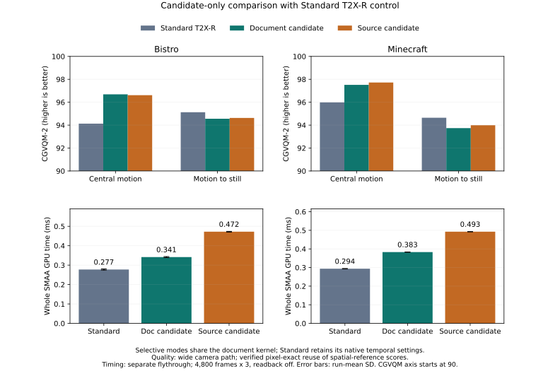

# 통합 후보식 단독 비교 및 핵심 구현 선정 결과

2026-09-15 · `research/tscmaa-candidate-selection-gate` · 기준 `31b881d`, 계측 구현 `3606d80`, 재질 공개 시점 수정 `fb1fe9c`.

## 핵심 결과

확보 소스의 후보식만 기존 temporal 계산에 결합한 경우를 평가했다. 두 선택적 구현 모두 SMAA 첫 edge 패스에 후보 생성을 통합했다. 소스 기반 temporal kernel과 sharpening/clipping 변경은 이번 비교에서 제외했다.

**후속 연구의 핵심 구현은 기존 document 후보식 + document temporal kernel로 유지한다.** 소스 후보식은 기존 후보식보다 CGVQM-2가 네 구간 중 세 구간에서 +0.067~+0.255 높았지만, Bistro 이동에서는 −0.073이었다. 반면 전체 AA 시간은 Bistro +38.31%, Minecraft +28.64% 증가했다. 따라서 현재 두 장면·설정에서는 기본 후보식을 교체할 근거가 부족하며, 소스 후보식은 품질·후보 범위 비교용 옵션으로 보존한다.

Temporal resolve는 소스 후보식에서 각각 0.001522/0.009334 ms 빨라졌으나, 공간 처리와 통합 후보 계산 구간이 0.131471/0.118361 ms 느려져 이를 상쇄했다. AA 시간 증가율은 전체 프레임 증가율이 아니다. 같은 비교의 WholeFrame 증가는 각각 +1.53%/+8.38%다.

기존 선택적 구현도 Standard T2X-R보다 AA 시간이 +23.11%/+30.42% 길었다. 이동 중 reference 점수 이점과 정지 전환 열세를 보였으므로, 이번 결과를 Standard 대비 속도·품질 동시 개선이나 전역 고스팅 해결로 표현하지 않는다.

## 비교 조건

| 표의 이름 | 실제 모드 |
|---|---|
| Standard T2X-R | `O-T2X-R` |
| 기존 후보 + 기존 temporal | `O-ET2X-R-DocCandidate-DocKernel` |
| 소스 후보 + 기존 temporal | `O-ET2X-R-SourceCandidate-DocKernel-Integrated` |

Original SMAA Ultra, DX11 Release x64, RTX 3060 Ti / Ryzen 5 5600, 1920×1017, VSync Off다. 두 선택적 모드는 first-pass integrated, CompactIndirect, expansion None, threshold 1/22, removal 0.5, camera/depth R, jitter Off, 기존 Catmull-Rom 5-tap/YCoCg variance clipping, weight 0.8, ResolvedOutput history와 두 복사 경로를 공유한다. Adaptive와 object velocity는 사용하지 않았다.

Standard는 공식 paired jitter/subsample, point history sampling, velocity 기반 weight 0..0.5, SpatialFrame history를 유지한다. 따라서 후보식 단독 효과는 두 선택적 모드 사이에서 평가한다. Standard 대비는 temporal 설정 묶음을 포함하는 실제 기법 비교다. Intel CMAA 기반 TSCMAA 전체를 재현한 결과는 아니다.

## 후보 계산의 코드 차이

| 항목 | 기존 document 후보 | 확보 소스 기반 후보 |
|---|---|---|
| 색 차이 | luma의 좌/상 차이 | 가중 RGB 채널별 절댓값 차이의 최대값 |
| 주변 대비 | 연결된 수직 방향 차이의 최대값 | threshold 차감 후 연결 edge 4개의 평균 |
| 최종 판정 | 방향 차이 − removal × 주변 최대값 > threshold | residual 4방향 중 하나가 0.5 × threshold 초과 |
| SMAA edge와 관계 | 기존 공간 edge 판정에서 살아남은 픽셀로 제한 | SMAA luma discard 전에 후보를 기록하며 luma edge로 제한하지 않음 |
| 입력 재사용 | 기존 axial luma 5개 재사용, diagonal 3개 추가 | 별도 UNORM RGB 입력의 주변 residual 계산 |
| 공유 실행 구조 | 첫 pixel pass에서 후보 compact → indirect resolve | 동일하며, Intel 원본의 compute/shared-memory 구조 전체를 재현한 것은 아님 |

코드: [통합 edge 함수와 document 후보식](../Projects/CMAA2/SMAA/SMAAWrapper.hlsl)의 `DX10_SMAALumaEdgeDetectionIntegratedTemporalCandidatesPS` / `TSCMAAIntegratedSelectCandidate`, [소스 후보식](../Projects/CMAA2/SMAA/RecoveredTSCMAACandidate.hlsl)의 `RecoveredDifference` / `RecoveredResidual` / `RecoveredFourEdges`다. 이번 작업은 이 수식을 바꾸지 않고 동일 temporal kernel의 비교 계측을 추가했다.

## 정확성과 자료 재사용

- 새 품질 캡처는 두 장면 × O-1X/Standard/두 선택적 구현 × 480프레임, 총 3,840프레임이다. 모두 기존 전체 출력과 RGB가 일치했다. O-1X도 기존 기준과 일치하므로 동일 pose의 supersample spatial reference 대응을 유지한다.
- 독립 short/full prefix 96프레임과 기본 8-case 96프레임도 일치했다. 최종 실행 파일의 SourceCandidate/DocKernel feedback은 35 output/34 previous 검사의 byte/hash mismatch 0이다.
- 새 mask 120프레임 × 2후보식 × 2장면은 기존 mask와 모두 일치했다. 각 후보식의 비후보 픽셀은 현재 spatial O-1X와 동일했다.
- CGVQM-2 12개 값은 새 점수 계산이 아니라 입력 전체 픽셀/프레임 index 및 reference hash가 일치한 기존 점수 재사용이다. Intel commit `8302ff45b4ff5a691682baf23f7c007d6b591e98`, CUDA, 60FPS, patch scale 4/mean, 기존 FFV1 전체 RGB round-trip mismatch 0을 검증했다. 이번 gate의 재질 로딩 수정 전 캡처에서 RGB MAE/PSNR/시간차분 잔차를 계산한 뒤, 수정 후 전체 PNG 3,840장과 short 96장이 파일 바이트까지 같은지 다시 검증해 수치 자료를 재사용했다. [수정 전후 검증](Candidate-Selection-Gate-20260915/publication-bridge.json)에 실행 파일 hash와 각 sequence hash를 기록했다.
- 품질 경로는 `flythrough-wide-yaw-360`, frame 0부터 동일 pose warm-up 60이다. 중앙 이동 150–329, 이동→정지 410–439, 후기 정지 440–479로 구분한다. Reference는 spatial proxy이며 절대 temporal/ghosting 정답이 아니다.

## 품질

CGVQM-2는 높을수록 reference에 가깝다.

| 장면 / 구간 | Standard | 기존 후보 | 소스 후보 | 소스−기존 |
|---|---:|---:|---:|---:|
| bistro / 중앙 이동 | 94.133018 | 96.688576 | 96.615211 | -0.073364 |
| bistro / 정지 전환 | 95.126778 | 94.560982 | 94.627953 | +0.066971 |
| minecraft / 중앙 이동 | 95.986458 | 97.515762 | 97.722359 | +0.206596 |
| minecraft / 정지 전환 | 94.646790 | 93.739021 | 93.993668 | +0.254646 |

RGB MAE는 0–255 단위이며 낮을수록 reference에 가깝다. 시간차분 잔차는 `mean(abs((test_t-test_t-1)-(ref_t-ref_t-1)))`이며 optical-flow 보정이나 절대 고스팅 측정은 아니다.

| 장면 / 구간 | 기존 MAE | 소스 MAE | 기존 시간차분 잔차 | 소스 시간차분 잔차 |
|---|---:|---:|---:|---:|
| bistro / 중앙 이동 | 1.515206 | 1.542664 | 2.445460 | 2.500814 |
| bistro / 정지 전환 | 1.517447 | 1.504401 | 0.265358 | 0.258485 |
| bistro / 후기 정지 | 1.515458 | 1.511794 | 0.000012 | 0.000012 |
| minecraft / 중앙 이동 | 0.859217 | 0.833994 | 1.442918 | 1.394531 |
| minecraft / 정지 전환 | 1.553114 | 1.505656 | 0.259703 | 0.236534 |
| minecraft / 후기 정지 | 1.574307 | 1.555636 | 0.000000 | 0.000000 |

## 반복 성능

각 장면의 새 clean process에서 Standard→기존→소스 / 소스→기존→Standard / Standard→기존→소스 순서로 반복했다. 모드마다 300 warm-up, 4,800프레임×3회, 총 14,400표본이다. visible 창, UI/PNG/candidate readback Off를 사용했다. 모든 예상 timer의 표본/반복 수와 내부 validation이 PASS다.

성능은 기존 flythrough의 start 0초 경로이며 wide 품질 경로와 다르다. 아래 비용과 품질 점수를 동일 프레임의 trade-off 곡선으로 해석하지 않는다. 세 반복의 평균 SD는 변동 설명이며 프레임을 독립 반복으로 간주한 유의성 검정은 하지 않았다.

| 장면 | 모드 | SMAA 평균 ms | p95 ms | 반복 평균 SD ms | WholeFrame ms | Wall 평균 FPS | Wall 1% low |
|---|---|---:|---:|---:|---:|---:|---:|
| bistro | Standard T2X-R | 0.277314 | 0.311296 | 0.003230 | 2.875217 | 342.237 | 277.400 |
| bistro | 기존 후보 + 기존 temporal | 0.341403 | 0.387072 | 0.002631 | 2.889945 | 341.315 | 276.978 |
| bistro | 소스 후보 + 기존 temporal | 0.472202 | 0.514048 | 0.001750 | 2.934063 | 336.570 | 274.597 |
| minecraft | Standard T2X-R | 0.293613 | 0.306176 | 0.000865 | 1.212706 | 799.164 | 633.593 |
| minecraft | 기존 후보 + 기존 temporal | 0.382936 | 0.403456 | 0.000706 | 1.319646 | 735.808 | 587.855 |
| minecraft | 소스 후보 + 기존 temporal | 0.492592 | 0.510976 | 0.000397 | 1.430186 | 680.230 | 552.761 |

WholeFrame은 Present를 제외한 GPU scope이고, Wall은 Present/OS scheduling을 포함하는 실제 tick 간격이다. 1% low는 프로젝트 정의인 `1000 / p99 wall ms`다. median/p99와 GPU-equivalent FPS도 [전체 통계](Candidate-Selection-Gate-20260915/performance.json)에 보존했다.

| 장면 | 기존 후보의 Standard 대비 SMAA | 소스 후보의 Standard 대비 SMAA | 소스 후보의 기존 대비 SMAA | 소스의 기존 대비 WholeFrame |
|---|---:|---:|---:|---:|
| bistro | +23.11% | +70.28% | +38.31% | +1.53% |
| minecraft | +30.42% | +67.77% | +28.64% | +8.38% |

### 추가 비용의 위치

| 장면 / timer | 기존 후보 ms | 소스 후보 ms | 차이 ms |
|---|---:|---:|---:|
| bistro / SMAASpatial1X | 0.231272 | 0.362743 | +0.131471 |
| bistro / TSCMAAClearIntegratedCandidateBuffers | 0.004229 | 0.004262 | +0.000033 |
| bistro / SMAAGenerateCameraVelocity | 0.023233 | 0.023400 | +0.000167 |
| bistro / TSCMAAComputeDispatchArgs | 0.004107 | 0.004144 | +0.000037 |
| bistro / TSCMAAResolveCandidates | 0.027883 | 0.026361 | -0.001522 |
| bistro / TSCMAACopySpatialToHistory | 0.023145 | 0.023384 | +0.000239 |
| bistro / TSCMAAOutputCopy | 0.023906 | 0.024099 | +0.000193 |
| minecraft / SMAASpatial1X | 0.257361 | 0.375722 | +0.118361 |
| minecraft / TSCMAAClearIntegratedCandidateBuffers | 0.003899 | 0.003899 | +0.000000 |
| minecraft / SMAAGenerateCameraVelocity | 0.022814 | 0.022904 | +0.000090 |
| minecraft / TSCMAAComputeDispatchArgs | 0.004027 | 0.004064 | +0.000037 |
| minecraft / TSCMAAResolveCandidates | 0.044973 | 0.035639 | -0.009334 |
| minecraft / TSCMAACopySpatialToHistory | 0.022812 | 0.022886 | +0.000074 |
| minecraft / TSCMAAOutputCopy | 0.023858 | 0.023936 | +0.000078 |

두 선택적 모드 모두 별도 `TSCMAAExtractCandidates`/`PrepareCandidates` timer가 없다. `SMAASpatial1X`에는 공간 처리와 통합 후보 계산이 함께 포함되므로 후보 계산만의 독립 시간이라고 표현하지 않는다.

기존 후보는 SMAA가 읽은 luma 표본을 재사용하고 살아남은 SMAA edge로 gate한다. 소스 후보는 SMAA discard 전에 weighted RGB residual과 주변 연결 edge 평균을 계산하며, SMAA edge로 다시 제한하지 않는다. 따라서 별도 패스를 제거해도 RGB 계산/접근 비용이 남는다. 이 구조 설명과 측정 구간은 부합하지만, 개별 texture load나 ALU의 기여를 분리한 hardware-counter 분석은 아니다.

## 후보 범위

아래는 품질 경로 첫 120프레임의 프레임당 평균이다. 성능 경로의 후보 수가 아니며, 각 식의 base 정의도 다르므로 candidate/base를 같은 모집단 비율로 비교하지 않는다.

| 장면 | 기존 후보 | 소스 후보 | 소스/기존 | 새로 선택 | 선택 해제 | Jaccard |
|---|---:|---:|---:|---:|---:|---:|
| bistro | 189986.8 | 204433.0 | 1.076 | 91064.2 | 76618.0 | 0.4034 |
| minecraft | 169528.1 | 278706.9 | 1.644 | 134310.6 | 25131.7 | 0.4753 |

후보는 기존 후보의 단순 부분집합이나 고정 50% quota가 아니다. readback-On smoke의 별도 짧은 성능 경로 후보 통계는 [smoke 자료](Candidate-Selection-Gate-20260915/smoke.json)에 구분해 보존했다.

## 핵심 구현 선정 이후

소스 temporal kernel의 [앞선 sharpening/clipping 실험](SMAA-Recovered-Sharpen-Segment-Results-ko.md)과 이번 후보식 단독 비교를 합쳐, 원본 소스 요소의 기본 적용 여부 검토를 이번 단계에서 마무리한다. 기존 8-case 설정은 변경하지 않는다. 현재 선택은 두 장면과 지정한 움직임 조건에 한정하며, 모든 환경에서 기존 후보식이 최적이라는 뜻은 아니다.

다음은 선정한 document core의 후보 확장 None을 기준으로 기존 3×3/ARM Dual Filter 옵션의 적용 조건을 정리하는 단계다. 우선 얇은 구조와 이동→정지 구간의 기존 결과를 감사하고, 확장으로 늘어난 후보가 안정성에 도움이 되는지와 비용 증가를 같은 조건에서 확인한다. Source 후보식이나 temporal kernel 변경을 함께 넣지 않아 확장 효과를 분리한다. 이번 gate의 성능 측정에서 Standard 대비 전체 AA 비용 이점이 확인되지 않았다는 점도 후속 최적화 목표로 유지한다.

## 검증 예외와 한계

Minecraft mask 준비 단계에서 두 번 정체했다. 첫 PID 3824는 약 214초 시점에 CPU 누적 2.328초, working set 약 535MB였다. CPU 이미지 분석을 종료한 후의 두 번째 PID 20184에서도 정체가 재현됐다. 두 시도는 해당 프로세스를 확인해 600초 자동 timeout 전에 수동 종료했고 결과에서 제외했다. 첫 시도의 정확한 원인은 확정하지 않았다.

두 번째 프로세스의 로컬 덤프에서 재질 Albedo 입력 macro 누락과 비어 있는 VS entry의 컴파일 오류 메시지를 확인했다. 코드 감사에서 비동기 재질 로딩 완료 전에 UID가 공개되는 경쟁 경로를 발견해, pack 로더에서는 deserialization 완료 후에 공개하도록 수정했다. 실제 APACK loader를 사용하는 독립 테스트 두 번에서 조기 조회 0, pack 삽입 후 정상 조회를 검증했다. 덤프 메시지와 코드 경로에 근거한 진단이며 실제 대기 stack을 unwind한 결과는 아니다. [수정 및 검증](SMAA-Material-Publication-Fix-ko.md), [실패 시도 요약](Candidate-Selection-Gate-20260915/readiness-incidents.json)을 참고한다. 전체 메모리 덤프는 로컬에만 보존한다.

수정 후 최종 manifest의 28개 독립 명령은 모두 정상 종료했고 실행 파일/AA HLSL hash가 일관됐다. 성능은 수정 후 실행 파일로만 측정했다. 이번 수정으로 이전 블루스크린 원인이나 모든 asset loading 경쟁 문제가 해결됐다고 주장하지 않는다.

분석 도구의 CSV 끝 빈 열 처리와 UTF-16 실행 로그 읽기 오류는 파서를 수정해 해결했다. 빌드 자체 이후 출력 인코딩 오류는 UTF-8 출력으로 재실행해 종료 코드 0을 확인했다. 수치 허용 기준을 완화한 수정은 없다.

## 자료

- [Bistro 이동 비교](Candidate-Selection-Gate-20260915/bistro-motion.mp4) · [정지 전환](Candidate-Selection-Gate-20260915/bistro-transition.mp4)
- [Minecraft 이동 비교](Candidate-Selection-Gate-20260915/minecraft-motion.mp4) · [정지 전환](Candidate-Selection-Gate-20260915/minecraft-transition.mp4)
- 영상은 두 후보식의 차이가 큰 프레임/고정 화면 ROI를 선택한 6배 느린 H.264 설명용 자료다. 점수 계산 입력이 아니며 object tracking이나 평균 대표 장면도 아니다. 프레임 수와 PTS를 decode 후 검증했다.
- [품질·hash·CGVQM 출처](Candidate-Selection-Gate-20260915/quality.json) · [후보 mask](Candidate-Selection-Gate-20260915/masks.json) · [실행 manifest](Candidate-Selection-Gate-20260915/runs.json)
- [실험 프로토콜](SMAA-Candidate-Selection-Gate-Protocol-ko.md). 원시 PNG/전체 AutoBench/실패 로그는 로컬에 보존하고 Git에는 선택한 결과 요약 CSV, 파생 통계와 비교 영상을 기록한다. 원래 ApplicationSettings.xml의 SHA-256 `02B00D01BA07E1CF60AE40C6C63DA3D5266120C01AE15BB44AA6E80432F9D3E6` 복원을 확인했다.
