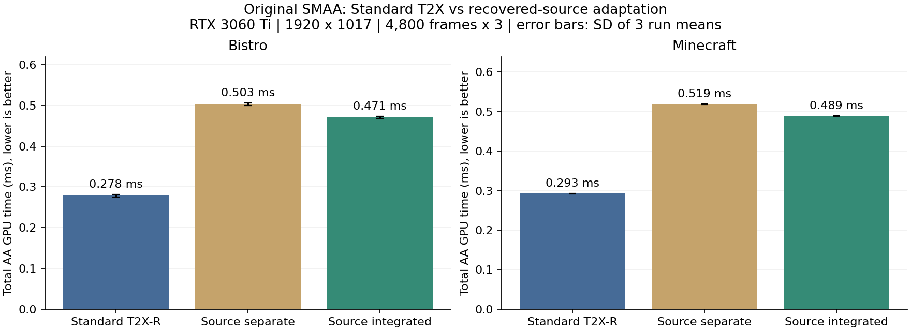
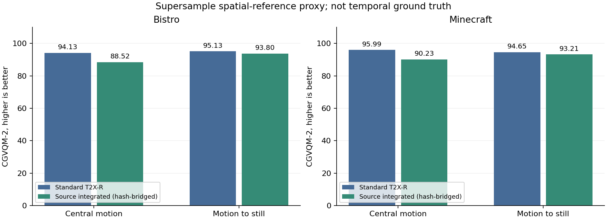

# 확보 소스 후보 통합 및 원본 SMAA T2X 기준선 비교 결과

후보 추출을 SMAA 첫 edge pass에 통합한 결과, 별도 패스 대비 AA GPU 시간이 Bistro **6.42%**, Minecraft **5.81%** 감소했다. 그러나 원본 Standard SMAA T2X-R 대비 AA 시간은 각각 **68.99%**, **66.95%** 증가했다. 별도 후보 Dispatch는 제거됐으며, 이 결과를 원본 T2X 대비 성능 우위나 Intel CMAA 기반 TSCMAA 전체의 재현이라고 표현하지 않는다.

## 비교 대상과 조건

| 대상 | 공간 처리 | Jitter/subsample | History 및 temporal | 후보 실행 |
|---|---|---|---|---|
| O-T2X-R | Original SMAA | 공식 T2X paired pattern | Point, velocity-adaptive 0..0.5, spatial-frame history | Standard full-screen resolve |
| Source-Separate | Original SMAA | None / SMAA 1X | 확보 source 5-fetch/clip/0.789473712, resolved feedback | 별도 RGB 후보 compute |
| Source-Integrated | Original SMAA | None / SMAA 1X | Source-Separate와 동일 | 첫 edge PS에서 RGB 후보 생성 |

모두 camera/depth reprojection On이며 object motion은 포함하지 않는다. Source 두 방식은 threshold 1/22, removal 0.5, expansion None, pre-AA UNORM RGB와 같은 min16float 후보 수식을 사용한다. Standard와 Source 비교는 jitter, sampling, clipping, weight, feedback까지 포함한 완성 방식 비교다. Candidate coverage 하나의 인과 효과로 해석하지 않는다. 기존 8-case 기본 설정은 유지했다.

성능: RTX 3060 Ti, Ryzen 5 5600, DirectX 11, Release x64, 1920×1017, Ultra. 각 장면의 기존 flythrough를 start=0부터 fixed 60 Hz로 진행하며 mode마다 같은 경로를 반복한다. Warm-up 300, 측정 4,800 frame×3회, 정/역방향 mode 순서 교대, visible window, VSync/UI/PNG/candidate readback Off. 두 실행 중 창이 표시되고 최소화되지 않았음을 별도 샘플로 확인했다. GPU WholeFrame은 Present를 제외한다.

품질: `flythrough-wide-yaw-360`, 480 frame, 첫 pose에서 warm-up 60. 세부 비교 구간은 중앙 이동 150..329 및 이동→정지 410..439다. 성능의 80초 flythrough와 품질의 8초 wide/yaw profile은 서로 다른 실험 경로이며, 각 실험 안에서는 비교 방식들이 같은 경로를 사용한다. Supersample은 spatial-reference proxy이며 temporal/ghosting ground truth가 아니다.

실행파일 SHA-256: `0366895E6412ADA1C2ACAA7D755D6AD702C3E24C717FB6746957099FB2AD8EC2`. 구현 commit `8f9f250`, 이전 별도 패스 기준 `b696c28`.

## 성능

AA 전체 GPU 시간, 단위 ms. ± 값은 세 run 평균의 표준편차이며 신뢰구간이 아니다.

| 장면 | 방식 | 평균 ± run SD | median | p95 | p99 |
|---|---|---:|---:|---:|---:|
| bistro | Standard T2X-R | 0.278472 ± 0.003228 | 0.293888 | 0.312320 | 0.315392 |
| bistro | Source-Separate | 0.502902 ± 0.003637 | 0.522240 | 0.546816 | 0.551936 |
| bistro | Source-Integrated | 0.470594 ± 0.002034 | 0.488448 | 0.512000 | 0.517120 |
| minecraft | Standard T2X-R | 0.292648 ± 0.000790 | 0.294912 | 0.305152 | 0.309248 |
| minecraft | Source-Separate | 0.518731 ± 0.000762 | 0.521216 | 0.536576 | 0.539648 |
| minecraft | Source-Integrated | 0.488571 ± 0.000303 | 0.490496 | 0.506880 | 0.510976 |

| 장면 | WholeFrame Standard | Separate | Integrated | Integrated vs Standard | Integrated vs Separate |
|---|---:|---:|---:|---:|---:|
| bistro | 2.865182 | 2.949157 | 2.925346 | +2.10% | -0.81% |
| minecraft | 1.250597 | 1.510572 | 1.470602 | +17.59% | -2.65% |

| 장면 | 방식 | 관측 wall 평균 FPS | wall 1% low FPS |
|---|---|---:|---:|
| bistro | Standard T2X-R | 343.34 | 278.22 |
| bistro | Source-Separate | 334.53 | 272.20 |
| bistro | Source-Integrated | 336.99 | 274.48 |
| minecraft | Standard T2X-R | 777.41 | 621.12 |
| minecraft | Source-Separate | 645.34 | 529.46 |
| minecraft | Source-Integrated | 663.38 | 540.92 |

1% low는 기존 연구 도구의 정의인 `1000 / p99 wall frame interval`이다. 전체 프레임 개선과 AA scope 개선은 구분한다.

### 남아 있는 비용

| 장면 | 별도 준비+추출 | 통합 control clear | Separate 공간 처리 | Integrated 공간+후보 처리 | Source candidate resolve | Standard temporal resolve |
|---|---:|---:|---:|---:|---:|---:|
| bistro | 0.180027 | 0.004186 | 0.219446 | 0.364188 | 0.023184 | 0.037053 |
| minecraft | 0.177491 | 0.003873 | 0.231089 | 0.375982 | 0.031609 | 0.037884 |

`SMAASpatial1X`는 edge/weight/neighborhood 전체 구간이다. 통합 후 이 구간에 RGB 후보 계산이 포함된다. 별도 추출 비용 대부분이 사라진 연산이 아니라 이 구간으로 이동했다. Source RGB residual은 기존 SMAA luma 계산과 다르므로, 현재 통합은 동일 pass 안에서 두 계산을 수행한다. Intel CMAA의 RGB edge 계산 재사용 및 compute tile 공유 구조까지 동일하게 만든 구현은 아니다.

선택적 candidate resolve 자체의 GPU 시간은 Standard temporal resolve보다 낮았다. 절감량은 Bistro 약 0.014ms, Minecraft 약 0.006ms다. 그러나 후보 생성이 포함된 공간 처리와 추가 copy 비용까지 합친 전체 AA에서는 이 이점이 상쇄됐다.

후보 수식을 고정한 구조 비교를 위해 Source-Separate의 mask 쓰기와 base counter 증가도 유지했다. 원본 T2X의 point resolve와 확보 source의 5-fetch/clipping/feedback 및 copy 비용도 서로 다르다. 후보가 edge의 약 절반이라는 사실만으로 전체 AA가 원본 T2X보다 빨라진다고 추론할 수 없다.

## 품질

CGVQM-2는 높을수록 좋다. Intel commit `8302ff45b4ff5a691682baf23f7c007d6b591e98`, CUDA, FPS 60, patch scale 4, mean pooling을 유지했다.

| 장면 | 구간 | Standard T2X-R | Source-Integrated | Source − Standard |
|---|---|---:|---:|---:|
| bistro | 중앙 이동 | 94.133018 | 88.522728 | -5.610291 |
| bistro | 이동→정지 | 95.126778 | 93.797829 | -1.328949 |
| minecraft | 중앙 이동 | 95.986458 | 90.230469 | -5.755989 |
| minecraft | 이동→정지 | 94.646790 | 93.207199 | -1.439590 |

네 CGVQM 비교 모두 Standard T2X-R이 높았다. 이번 조건에서 source adaptation의 주 지표 품질 우위는 확인되지 않았다.

**계산 이력:** Standard 네 window는 이번 캡처로 새로 계산했다. Source 네 window는 이전 source 기반 계산을 재사용했다. 재사용 전에 두 장면의 신규 통합/신규 별도/이전 source 480 frame 전체의 PNG 및 decoded RGB 동일성을 확인했고, 각 CGVQM window의 index 포함 pixel SHA-256과 reference SHA-256을 다시 확인했다. Test/reference FFV1 round-trip mismatch는 모든 연결 결과에서 0이다. Source 점수를 신규 GPU 계산으로 표현하지 않는다.

평균 RGB 절대 오차(0..255, 낮을수록 좋음)는 다음과 같다.

| 장면 | 구간 | Standard T2X-R | Source-Integrated |
|---|---|---:|---:|
| bistro | 중앙 이동 | 2.213424 | 1.725275 |
| bistro | 이동→정지 | 1.517998 | 1.653184 |
| bistro | 정지 후 | 1.448690 | 1.642751 |
| minecraft | 중앙 이동 | 1.223720 | 0.956796 |
| minecraft | 이동→정지 | 1.531736 | 1.545917 |
| minecraft | 정지 후 | 1.486788 | 1.573481 |

이동 중에는 Source의 평균 픽셀 오차가 낮지만, 정지 전환/정지 후에는 Standard가 낮았다. CGVQM과 평균 픽셀 오차의 방향도 같지 않다. 어느 지표 하나를 절대 고스팅 정답으로 해석하지 않으며 PSNR, stride-8 luma SSIM, edge ratio, temporal-delta residual은 동봉 JSON에 보존했다.

## 정확성과 실패 기록

- 별도/통합 final 480 frame×2장면 = 960 frame PNG mismatch 0. 이전 source final과도 동일하다.
- 두 장면의 same-draw snapshot 14 step, candidate=process, actual indirect args, base/selected mask와 list 집합 검사 PASS. 중복/OOB/overflow/mismatch 0.
- 12-frame mask 및 비후보=current spatial 검사 두 장면 PASS. Forced count 0/1/63/64/65/full-capacity PASS.
- 기본 8-case 96 PNG 변경 전후 동일. Lifecycle 및 integrated source feedback PASS.
- Shared 후보 함수 분리 전후 기존 extraction/resolve CS의 FXC bytecode 동일. 통합 PS Original/Adaptive×RGB/raw 4 variant compile PASS.
- 최초 Bistro CPU 품질 분석 한 번에서 decoded hash 1-frame 불일치가 보고됐다. 이 시도는 제외했다. 해당 세 sequence의 PNG 파일 해시는 모두 같았고, 독립 재판독 480×3 frame 및 전체 분석 재실행은 mismatch 0으로 통과했다. 재계산한 Source 품질 요약값 40개는 이전 결과와 정확히 같았다. 최초 일회성 보고의 원인은 확정하지 않았으며, 이를 renderer 오류 또는 블루스크린 원인으로 단정하지 않는다. 실패 기록을 별도 보존했다.

## 재현 및 다음 판단

실행: `Tools/SMAA/run_integrated_source_comparison.ps1`. 검증: `validate_integrated_source_equivalence.py`. 분석: `analyze_integrated_source_comparison.py`, `run_integrated_source_cgvqm.py`, `summarize_integrated_source_results.py`. 각 실행 명령·exe hash·raw report 경로는 동봉 결과 JSON에 있다. Raw AutoBench 및 캡처 파일은 Git에 넣지 않는다.

후보 first-pass 통합 및 올바른 Standard T2X 기준선 비교는 완료했다. 원본 T2X보다 빠른 방법을 확보한 것은 아니다. 후속 최적화에서는 RGB 이웃 로드/계산 공유와 부가 mask/counter 비용을 측정하며, 후보 수식·출력 동일성을 유지하는 변경과 kernel/quality 변경을 별도 실험으로 분리해야 한다. 동일 source kernel의 full-screen control은 후보 coverage만의 효과를 분리하는 추가 비교이며 이번 Standard 비교를 대체하지 않는다.

상세: `Integrated-Recovered-Candidates-20260914/comparison.json`, `equivalence.json`, `cgvqm.json`, `cgvqm.csv`. 공개 원격 push는 별도 승인 확인 전 보류한다.
