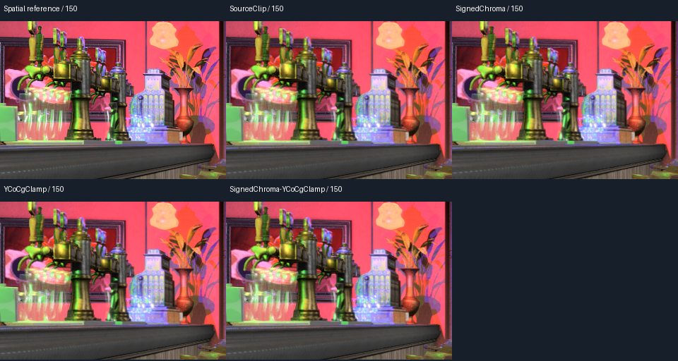
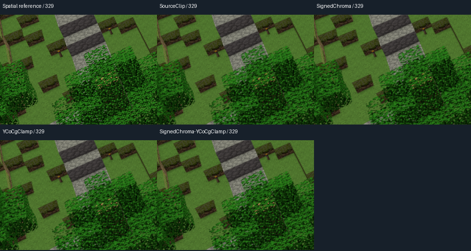

# 확보 소스 clipping 2×2 분리 실험 결과

날짜: 2026-09-15. 구현 커밋: `f64d12a`. 기준: `c5b5a14`.
브랜치: `research/tscmaa-source-clipping-ablation`.

**결론: clipping의 두 수정을 결합하면 정지 전환의 품질 오차 일부를 줄일 수 있지만,
이동 중 큰 품질 격차와 성능 병목은 해결되지 않았다.** CGVQM-2 개선은 중앙 이동에서
Bistro +0.131233 / Minecraft +0.305862, 이동→정지에서 +0.686699 / +0.394600이었다.
AA 시간 변화는 +0.311% / −0.087%로 세 쌍의 반복 변동 범위에서 뚜렷하지 않았다.
기존 document kernel을 기본 연구 구현으로 유지하고, 이번 옵션은 소스 분석용 ablation으로 보존한다.

## 무엇을 분리했는가

원본 source kernel의 품질 열세를 조사하기 위해 후보 생성은 첫 edge 패스에 통합한 상태로
고정하고 clipping의 두 계산만 바꿨다. 이번 변형은 확보 소스 그대로의 재현이 아니라
원인을 분리하기 위한 SMAA 연구 옵션이다. 기본 스위치는 모두 Off이며 기존 8-case를 바꾸지 않았다.

| 조합 | 중심 YCoCg 색차 처리 | variance box 적용 |
|---|---|---|
| SourceClip | Y·Co·Cg 모두 max(0, 값) | 두 끝점을 RGB로 변환한 뒤 RGB clamp |
| SignedChroma | Y만 max(0, 값), Co·Cg 부호 유지 | 원본 RGB clamp 유지 |
| YCoCgClamp | 원본 max(0, 값) 유지 | history를 YCoCg로 변환해 clamp한 뒤 RGB 복원 |
| SignedChroma-YCoCgClamp | 색차 부호 유지 | YCoCg clamp |

YCoCg에서 만든 box의 두 대각 끝점만 RGB로 변환하면 RGB 축에 정렬된 최소·최대가 되지
않는다. 변환 행렬에 음수 계수가 있어 성분별 순서가 역전될 수 있다. 이번 YCoCgClamp는
RGB 끝점을 임의로 정렬하는 대신 box를 정의한 색 공간에서 제한한다.

공통 조건은 Original SMAA Ultra, source RGB 후보식, removal 0.5, expansion None,
CompactIndirect, camera/depth reprojection On, jitter Off, source 5-fetch sampling,
sharpen 0.263157904, history weight 0.789473712, 제곱/제곱근 blend, R8 packing,
ResolvedOutput feedback이다. 음수 색차 보존 옵션에서도 중심 Y의 하한 0은 유지했다.
Object motion vector와 3×3/Dual Filter 확장은 사용하지 않았다.

두 옵션을 바꾸어도 기존 document kernel의 clipping과 같아지지는 않는다. Document kernel은
중심 sharpening 없이 3×3 통계를 만들고 관측한 이웃 min/max와 variance box를 교차한 뒤
현재 색→history 선분을 clipping한다. 이번 실험은 source의 중심 sharpening과
성분별 clamp를 유지한다. 입력 색 공간, history sampler, blend 방식도 계속 source 설정이다.

## 정확성과 재현 조건

- 기본 조합의 `RecoveredExtractCS`와 `RecoveredResolveCS`는 기준 커밋의 DXBC와 일치했다.
  네 조합 모두 source extract DXBC가 같고, resolve는 224/224/227/227 instruction slots였다.
  정적 명령 수는 GPU 시간 측정을 대신하지 않는다.
- 기존 production-function D3D11 harness를 다시 빌드해 8개 합성 영상, 35×29 픽셀을
  네 조합별로 두 번 검사했다. 반복 binary가 일치하고 candidate/sampler 출력도 네 조합에서
  동일했다. 모든 출력은 유한했다. 독립 float64 CPU식 대비 clipping 최대 오차는 0.005 미만,
  최종 색은 최대 2 byte 이내의 기존 filtering/minprecision 허용 오차를 통과했다.
- 원본 SourceClip의 단색 중심 probe는 빨강 (255,0,0)을 (234,0,24), 파랑 (0,0,255)을
  (0,0,194)로 출력했다. 나머지 세 조합의 같은 최종 probe는 각각 (255,0,0), (0,0,255)를
  보존했다. 이는 함수 진단이며 단색 화면 전체가 변색된다는 뜻은 아니다. 단색 내부는
  보통 temporal 후보가 아니다.
- 짧은 실제 장면 검사에서 두 장면×네 조합×12프레임의 후보 mask가 이전 mask와 일치했다.
  SourceClip의 짧은 출력도 이전 source capture와 일치했다.
- 품질 캡처는 Bistro/Minecraft, 1920×1017, `flythrough-wide-yaw-360`, fixed 60 Hz,
  첫 pose warm-up 60, 전체 480프레임이다. 총 3,840프레임을 독립 clean process 8개로 저장했다.
  비교 구간은 중앙 이동 150–329, 이동→정지 410–439, 정지 후 440–479다.
- supersample은 동일 pose의 spatial-reference proxy이며 절대 temporal/ghosting 정답이 아니다.
  Temporal-delta residual은 `(test_t-test_(t-1))-(ref_t-ref_(t-1))`의 절대 평균으로 정의했다.
- CGVQM-2는 Intel commit `8302ff45b4ff5a691682baf23f7c007d6b591e98`, CUDA,
  60 FPS, patch scale 4, mean pooling을 사용한다. FFV1/bgr0 변환 전후 모든 RGB 값을 검사한다.
  SourceClip의 이전 점수는 새 capture와 reference의 해당 구간 pixel hash가 모두 일치할 때만
  재사용한다. 나머지 세 조합은 새로 계산한다.

검증 원시값과 실행 provenance는 동반 JSON에 저장한다. 실행 manifest에는 기존 앱 mode 이름과
별도로 의미 이름, 두 컴파일 스위치, 실행 파일·utility·candidate shader hash를 기록했다.

추가 확인: 각 조합의 짧은 캡처와 전체 캡처 앞 12프레임, 총 96프레임의 독립 실행 결과가
RGB hash로 일치했다. 짧은 캡처에서 비후보 픽셀의 변경도 0개였다. 원본 SourceClip 전체
960프레임은 이전 source 결과와 RGB hash가 일치했다.
## 품질 결과

CGVQM-2는 높을수록 좋다. 아래 네 조합은 후보식·실행 구조가 같고 clipping 두 항목만 다르다.

| 장면·구간 | SourceClip | SignedChroma | YCoCgClamp | 두 수정 결합 |
|---|---:|---:|---:|---:|
| Bistro 중앙 이동 | 88.522728 | 88.555344 | 88.640076 | 88.653961 |
| Bistro 이동→정지 | 93.797829 | 94.043610 | 94.462967 | 94.484528 |
| Minecraft 중앙 이동 | 90.230469 | 90.216133 | 90.540466 | 90.536331 |
| Minecraft 이동→정지 | 93.207199 | 93.262352 | 93.614258 | 93.601799 |

두 수정 결합은 SourceClip보다 네 구간의 점수가 모두 높다. 그러나 Minecraft에서는
음수 색차 보존만 적용하면 중앙 이동 점수가 소폭 하락했고, YCoCgClamp 단독이 결합보다
두 구간 모두 조금 높았다. 결합을 모든 조건의 최적 조합이라고 부르지 않는다.

### 기존 구현·Standard와의 비교

다음 대조군은 이번에 새로 캡처한 것이 아니라 이전 검증 결과다. 동일 reference의 구간 hash,
공식 CGVQM commit·설정·최종 무손실 검증을 다시 확인했다.

| 장면·구간 | Standard O-T2X-R | 기존 후보·기존 kernel | 소스 후보·기존 kernel | 소스 후보·소스 kernel + 두 수정 |
|---|---:|---:|---:|---:|
| Bistro 중앙 이동 | 94.133018 | 96.688576 | 96.615211 | 88.653961 |
| Bistro 이동→정지 | 95.126778 | 94.560982 | 94.627953 | 94.484528 |
| Minecraft 중앙 이동 | 95.986458 | 97.515762 | 97.722359 | 90.536331 |
| Minecraft 이동→정지 | 94.646790 | 93.739021 | 93.993668 | 93.601799 |

같은 소스 후보에 기존 kernel을 붙인 조합보다 수정한 소스 kernel의 CGVQM-2가 네 구간 모두
낮다. Standard O-T2X-R보다도 모두 낮다. 따라서 이번 수정으로 기존 temporal 구현을
대체하거나 global ghosting 문제를 해결했다고 결론내릴 수 없다.

### 공간 reference 오차와 시간 변화

MAE는 RGB 0–255 단위이고 낮을수록 좋다.

| 장면·구간 | SourceClip MAE | 결합 MAE | 변화 | SourceClip 시간 차분 residual | 결합 residual |
|---|---:|---:|---:|---:|---:|
| Bistro 중앙 이동 | 1.725275 | 1.709660 | -0.905% | 2.70889617 | 2.68484272 |
| Bistro 이동→정지 | 1.653184 | 1.515523 | -8.327% | 0.26649781 | 0.25558028 |
| Bistro 정지 후 | 1.642751 | 1.507557 | -8.230% | 0.00001207 | 0.00001208 |
| Minecraft 중앙 이동 | 0.956796 | 0.948219 | -0.896% | 1.46695197 | 1.45241394 |
| Minecraft 이동→정지 | 1.545917 | 1.515374 | -1.976% | 0.23423986 | 0.23116204 |
| Minecraft 정지 후 | 1.573481 | 1.548721 | -1.574% | 0.00000001 | 0.00000038 |

두 장면 모두 정지 전환의 MAE가 줄지만, 이동 중 변화는 약 0.9%에 머문다. 정지 후에는
원본과 수정 모두 시간 변화가 거의 없으므로 정지 후 MAE 감소를 깜빡임 감소로 대신하지 않는다.
새 조합의 PSNR과 2×2 주효과·상호작용은 quality.json에 포함했다.
지표는 프레임별 값을 구한 뒤 구간 내 산술평균했다. 시간 차분은 구간 첫 프레임에서도
전체 타임라인의 직전 프레임을 사용한다. 새 조합의 별도 선명도 지표나 object-motion 품질을
검증한 것은 아니다.

### 두 요소의 효과 분리

다른 요소의 두 수준에서 차이를 평균한 주효과다. 상호작용은 `CY − Y − C + SourceClip`이다.
품질 영상 한 경로에 대한 기술 통계이며 독립 장면 집단의 통계적 유의성을 뜻하지 않는다.

| 장면·구간 | SignedChroma 주효과 | YCoCgClamp 주효과 | 상호작용 |
|---|---:|---:|---:|
| Bistro 중앙 이동 | +0.023251 | +0.107983 | -0.018730 |
| Bistro 이동→정지 | +0.133671 | +0.553028 | -0.224220 |
| Minecraft 중앙 이동 | -0.009235 | +0.315098 | +0.010201 |
| Minecraft 이동→정지 | +0.021347 | +0.373253 | -0.067612 |

이번 네 구간에서는 YCoCgClamp 주효과가 더 컸다. 두 수정의 효과는 단순 합산되지 않는다.
이 결과로 소스 kernel 전체 열세의 몇 %가 특정 코드 탓인지 단정하지 않는다.

## 성능 결과

RTX 3060 Ti / Ryzen 5 5600, DX11, 1920×1017, Vsync Off, visible window.
각 장면에서 SourceClip/결합을 AB, BA, AB 순서로 독립 프로세스 세 쌍 실행했다.
각 프로세스 안에는 Standard O-T2X-R, 소스 별도 후보 패스, 소스 첫 패스 통합의 세 mode가 있다.
mode마다 300 warm-up, 4,800 측정 프레임이며 PNG 및 후보 counter readback은 Off다.
두 source 실행 구조에는 동일한 clipping 스위치가 적용된다. Standard는 변하지 않는다.
2초 간격의 읽기 전용 관측에서 12개 프로세스 모두 표시되고 최소화되지 않은 창이 확인됐다.
이는 창이 다른 프로그램에 가려지지 않았다는 검증이나 독점 GPU 사용 보장은 아니다.

| 장면 | SourceClip AA ms | 결합 AA ms | 쌍별 변화 평균 | 차이의 95% 구간 ms | 같은 실행의 Standard AA ms | 결합 / Standard |
|---|---:|---:|---:|---|---:|---:|
| Bistro | 0.467334 | 0.468765 | +0.311% | [-0.006806, +0.009666] | 0.274910 | +70.52% |
| Minecraft | 0.488878 | 0.488446 | -0.087% | [-0.007879, +0.007015] | 0.292870 | +66.78% |

Standard 열은 결합 조합과 같은 세 프로세스의 평균이다. CI는 세 독립 쌍 차이에 대한
보정하지 않은 t(2) 기술 구간이며 수천 프레임을 독립 반복으로 취급하지 않았다.

| 장면 | SourceClip WholeFrame ms | 결합 WholeFrame ms | Standard 전 ms | Standard 후 ms |
|---|---:|---:|---:|---:|
| Bistro | 2.989912 | 2.963623 | 2.908664 | 2.900403 |
| Minecraft | 1.437182 | 1.451142 | 1.221351 | 1.229340 |

전체 AA, WholeFrame 및 pass별 결과는 performance.json에 별도로 보존했다.
두 장면의 AA 차이 구간이 모두 0을 포함하므로, 비용이 동일하다고 입증하거나 빨라졌다고
주장하지 않는다. WholeFrame의 전후 변화 역시 반복 변동과 Standard 대조군의 변화를 함께
보아야 한다. 수정 조합도 같은 실행의 Standard보다 AA GPU 시간이 약 70.52% / 66.78% 크다.
이는 AA 처리 시간의 비교이며 게임 전체 FPS가 그만큼 낮다는 뜻이 아니다.

## 연구 방향 판단

소스의 음수 색차 처리와 RGB clipping 끝점 변환은 수치적으로 검토할 가치가 있었고,
정지 전환 개선으로 이어졌다. 그러나 이 두 항목을 변경해도 같은 소스 후보 + 기존 kernel보다
CGVQM-2가 네 구간 모두 낮다. 원본 source kernel 전체로 교체할 근거는 얻지 못했다.
3×3 확장을 섞지 않고 원인을 분리한 결과로 보존한다.

추가로 소스 kernel을 조사한다면 아직 고정한 중심 sharpening, 성분별 clamp와 기존
segment clipping의 차이를 먼저 별도 비교할 수 있다. 그 이후 sampling과 blend 색 공간도
독립 항목이다. 이번 결과만으로 그중 어느 하나가 주원인이라고 지목하지 않는다.

## 실행 기록과 자료

시작 장면은 이전에 확인한 시작 단계 종료 문제를 피하기 위해 임시로 Bistro(0)를 사용했다.
실제 측정 장면은 AutoBench에서 설정하며, 종료 후 사용자 ApplicationSettings.xml을 원본
SHA-256 `02B00D01BA07E1CF60AE40C6C63DA3D5266120C01AE15BB44AA6E80432F9D3E6`와 일치하게 복원했다.
두 clipping 스위치도 0으로 복원했다. 각 CMAA2 실행은 timeout 및 종료·결과 CSV 검증을 거쳤다.
이번 gate의 CMAA2 캡처 24회와 성능 12회는 모두 정상 종료·완성 CSV 검사를 통과했다.

- [검증 및 GPU probe](Recovered-Clipping-Ablation-20260915/validation.json), [후보·독립 실행 확인](Recovered-Clipping-Ablation-20260915/verify.json)
- [품질 및 실행 provenance](Recovered-Clipping-Ablation-20260915/quality.json), [CGVQM 및 과거 대조군](Recovered-Clipping-Ablation-20260915/cgvqm.json)
- [반복 성능과 창 관측](Recovered-Clipping-Ablation-20260915/performance.json)
- [Bistro 이동](Recovered-Clipping-Ablation-20260915/bistro-motion.mp4), [Bistro 정지 전환](Recovered-Clipping-Ablation-20260915/bistro-transition.mp4)
- [Minecraft 이동](Recovered-Clipping-Ablation-20260915/minecraft-motion.mp4), [Minecraft 정지 전환](Recovered-Clipping-Ablation-20260915/minecraft-transition.mp4)

영상은 60 Hz 측정 입력을 10 FPS로 보여 주는 6배 느린 H.264 관찰용 사본이다. 점수 계산에는
사용하지 않았다. ROI는 중앙 이동에서 SourceClip과 결합의 차이가 큰 위치로 선택했으므로
전체 화면을 대표하는 통계 표본으로 취급하지 않는다. 전체 프레임 지표를 함께 해석한다.

재현 순서: validate_recovered_clipping.py → run_recovered_clipping.ps1의 Short/Masks →
analyze_recovered_clipping.py --mode verify → Quality → 두 장면 quality 분석 →
run_recovered_clipping_cgvqm.py → summarize_recovered_clipping_cgvqm.py → Benchmark와
observe_recovered_clipping_windows.ps1 동시 실행 → analyze_recovered_clipping_performance.py.
캡처 종료 후 --compare-full-prefix로 독립 앞부분 반복을 검사한다. 영상 생성에는
create_recovered_clipping_media.py를 사용한다. 비교 조건은 [프로토콜](SMAA-Recovered-Clipping-Ablation-Protocol-ko.md)을 따른다.
