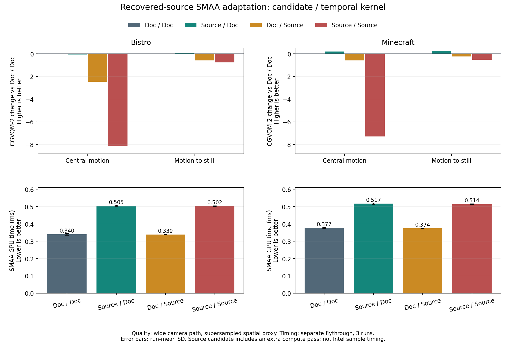

# 확보 TSCMAA 소스 기반 SMAA와 기존 구현 비교

## 1. 비교의 의미

기존 `research/tscmaa-source-audit`의 `4fa5f8b`를 기준으로
`research/tscmaa-source-based-smaa`를 만들었다. 설계는 `7bb5eba`, 첫 구현은 `369eabd`다.
최종 코드·검증 도구 커밋은 `de42492`다.
기존의 문서 기반 구현을 보존하면서 확보 소스의 후보식과 temporal kernel을 독립적으로
교체했다. 공간 AA는 **Original SMAA**, 재투영은 **camera/depth On**으로 고정했다.

이 결과는 CMAA 공간 처리까지 포함한 Intel TSCMAA 실행파일 재현 결과가 아니다.
원본의 수식에 근거한 **SMAA adaptation**이며 기존 8-case의 기본 알고리즘을 바꾸지 않는다.
기준 파일과 원본의 host/표시 경로 한계는
[확보 소스 분석](SMAA-Recovered-TSCMAA-Pipeline-Analysis-ko.md)에 기록되어 있다.
이번에는 그 소스의 활성 수식을 이식했으며, 동봉 EXE의 출처나 Intel 발표 수치까지
재현·인증한 것은 아니다.

| CLI profile | 전체 진단 ID | 후보 | Kernel |
|---|---|---|---|
| 0 | O-ET2X-R-DocCandidate-DocKernel | 기존 | 기존 |
| 1 | O-ET2X-R-SourceCandidate-DocKernel | 확보 소스 | 기존 |
| 2 | O-ET2X-R-DocCandidate-SourceKernel | 기존 | 확보 소스 |
| 3 | O-ET2X-R-SourceCandidate-SourceKernel | 확보 소스 | 확보 소스 |

`profile` 번호는 CLI의 비트 조합이고 연구 결과의 case 이름을 대체하지 않는다.
이하 표의 Doc/Doc, Source/Doc, Doc/Source, Source/Source는 위 순서의 축약이다.

## 2. 코드에서 달라진 부분

| 항목 | 기존 document 구현 | 확보 소스 기반 구현 |
|---|---|---|
| 색 차이 | luma 차이 | UNORM RGB에서 `max(abs(A*w-B*w))`, w=(0.299,0.587,0.114) |
| 후보 base | 살아남은 SMAA first-pass edge로 gate | 확보 식의 사방 residual; SMAA edge mask로 다시 gate하지 않음 |
| Threshold | 방향별 luma 대비와 비교 | 차이에서 1/22를 먼저 뺀 뒤 saturate |
| 비주요 edge 제거 | 연결 수직 대비의 최댓값 | 연결 수직 residual 네 개의 평균 × 0.5 제거 |
| 최종 후보 | 기존 threshold 조건 | 사방 residual 중 하나라도 `(1/22)/2` 초과 |
| History filtering | 기존 normalized cross 5-tap | 원본 A/B/C/D/E 5-fetch 식, 비대칭 A+B 항 포함 |
| 필터 계산 공간 | sRGB SRV의 linear 값 | 별도 UNORM SRV의 값 |
| 화면 밖 history | UV reject 및 clamp sampler | black-border sampler; 유한 velocity는 화면 밖에서도 필터 수행 |
| Clipping | YCoCg variance/min-max box와 segment clip | center sharpen 0.263157904, YCoCg mean/sigma의 RGB endpoint clamp |
| History weight | 0.8 | 0.789473712 |
| Blend 및 저장 | linear blend와 sRGB encoding | min16 helper 경계의 square/sqrt 근사, 명시적인 R8 반올림 |
| Feedback | resolved output | 동일 |
| 비후보 | current SMAA spatial | 동일 |

구현 위치:

- `Projects/CMAA2/SMAA/RecoveredTSCMAA.hlsl`: 후보식, 안전한 compact/resolve, source blend.
- `Projects/CMAA2/SMAA/RecoveredTSCMAAUtility.hlsl`: 확보 Util의 5-fetch/clip 식과 색 변환.
- `Projects/CMAA2/SMAA/vaSMAAWrapperDX11.cpp`: UNORM history views, border sampler, 별도 shader 선택.
- `Projects/CMAA2/CMAA2Sample.cpp`: 2×2 paired benchmark, profile snapshot, 명시적인 capture ID.

공간 SMAA 셰이더와 기존 document temporal 셰이더 수식은 수정하지 않았다. 후보 추출은
SMAA spatial 처리 후 실행하지만 별도 보존된 **AA 이전** 입력을 읽는다. Clipping은
**SMAA 이후** current spatial을 읽는다. History를 sRGB로 읽고 나서 역변환하는 근사 대신
UNORM SRV에서 직접 filtering하므로 원본의 계산 공간을 유지한다.

## 3. 원본 대비 명시적인 변경과 한계

1. 원본의 fused CMAA/group-shared 추출 대신 안전한 per-pixel compute로 같은 후보식을
   계산한다. 별도 패스의 비용을 포함하므로 이를 Intel 원본 성능으로 해석하지 않는다.
2. `list[index]`보다 먼저 `index >= min(count,capacity)`를 검사한다. 후보 capacity는
   전체 화면 픽셀 수다. 원본의 절반 크기 buffer를 후보 50% 할당량으로 해석하지 않는다.
3. Texture.Load의 black halo를 명시하고 화면 밖 output 쓰기를 막는다. 원본 shared halo의
   불확실한 경계 접근 및 first-history/resize 오류를 복제하지 않는다.
4. 기존 current-frame seed, ping-pong/reset, 올바른 previous projection을 유지한다.
   재투영은 검증된 camera velocity 경로를 재사용한다. 원본의 직접 FP32 matrix 계산과
   우리 R16G16 velocity 저장은 수치적으로 완전히 같다는 보장이 없다.
5. `sqrt(variance)` 전에 음수 반올림을 0으로 제한한다. RGB endpoint 역전, 음수 chroma
   제거, 비대칭 bicubic 항은 기준 수식에 남겼다. 품질을 좋게 보이도록 교정하지 않았다.
6. 이 첫 gate의 Source kernel은 sampler·clip·weight·색 공간을 묶은 원본 수식 묶음이다.
   어느 세부 요소가 개선/악화를 일으켰는지는 후속 kernel component ablation이 필요하다.
7. 2×2 비교에서는 모두 기존 기본값과 같은 두 복사 경로를 사용한다. 후보 감소만으로
   속도 개선을 주장하지 않으며 복사, 추출, resolve, 전체 SMAA 시간을 함께 기록한다.

## 4. 정확성 검증

환경: RTX 3060 Ti, Ryzen 5 5600, DX11, Release x64, SMAA Ultra, 1920×1017.

| 검사 | 결과 |
|---|---|
| 기본 8-case 변경 전후 | 96 PNG SHA-256 mismatch 0 (`140823` → `142134`) |
| 기존 lifecycle | reset 60, frame 160, seed 35, resolve 125, failures 0 (`142151`) |
| Source/Source feedback | 35 output checks, 34 previous checks; byte/hash mismatch 0 (`142126`) |
| 2×2 same-draw snapshot | 두 장면 × 7 전환, 중복/OOB/overflow/mask/args mismatch 모두 0 (`142007`) |
| 후보 경계 | 0/1/63/64/65/1,952,640; 실제 candidate=process, ceil(count/64), 읽기 경계 PASS |
| GPU 함수 수치 | 8 fixture × 35×29 pixel, 반복 binary 동일, 유한값, 후보 판정 mismatch 0 |

실행 ID의 앞 날짜는 모두 `20260914_`다. 후보 경계의 독립 실행은
`142336`, `142345`, `142355`, `142404`, `142414`, `142423`이다.

독립 float64 image reference 대비 residual 최대 오차는 0.000464621, 5-fetch/clip 최대
오차는 0.00368356, 최종 R8 계산은 약 1 byte 차이였다. min16float와 hardware bilinear
보간 정밀도 차이를 허용한 함수 검증이며, 원본 전체 GPU 프로그램과 byte-exact 비교는 아니다.
기준의 비대칭 필터 및 단색 chroma 문제도 테스트에 포함했다.

함수만 직접 실행한 단색 fixture의 중앙 픽셀에서 회색은 `(128,128,128)`을 유지했지만,
빨강 `(255,0,0)`은 `(234,0,24)`, 파랑 `(0,0,255)`은 `(0,0,194)`가 됐다.
빨강의 clip 결과는 약 `(0.893720,0,-0.106367)`이며 후속 square/sqrt가 음수 성분도
양수로 바꾼다. 이는 확보 식을 보존한 계산 결과다. **균일 영역 내부는 보통 비후보**이므로
이 검사를 화면 전체의 색 변질이라고 해석하지 않는다. 실제 edge 이웃에서의 기여도는
clipping·blend를 분리한 후속 검사 대상이다.

Snapshot에서 고정 pose의 후보 수는 다음과 같다. 장면 전체의 품질·성능 대표값은 아니다.

| 장면 | 기존 후보 | 확보 식 후보 | 변화 |
|---|---:|---:|---:|
| Bistro | 27,759 | 24,466 | -11.86% |
| Minecraft | 342,046 | 336,782 | -1.54% |

같은 snapshot에서 source residual base는 Bistro 44,847, Minecraft 579,622였고,
source temporal 후보/base는 각각 약 54.6%, 58.1%였다. 이 base는 기존 SMAA edge와
정의가 다르며 후보량을 50%로 강제한 결과가 아니다.

Kernel을 교체해도 같은 후보식의 mask가 동일했고, 이전 profile로 돌아왔을 때도 mask가
동일했다. 후보 축과 kernel 축이 독립적으로 연결됐음을 확인했다.

초기 실패 자료도 보존했다. 첫 baseline 캡처는 AutoBench의 D드라이브 junction 쓰기 권한
문제로 실패했으며 결과로 사용하지 않았다. 첫 source feedback 실행 `142016`은 동일한
sampler/clip 값을 explicit override로 설정한 것을 guard가 과도하게 거부했다. 해당 프로세스를
종료하고 값 기준 검사로 수정한 뒤 위 `142126`에서 재검증했다.

## 5. 전체 경로 품질 및 후보 mask 비교

두 장면 × 4 profile × 480 frame와 O-1X control 960 frame를 촬영했다.
두 장면의 새 O-1X 480 frame씩은 기존 같은 경로의 O-1X와 pixel-hash mismatch 0이었다.
따라서 기존 2× 선형 해상도·3×3 subpixel·8×MSAA reference와의 pose/content 대응을 확인했다.
해상도 1920×1017, warm-up 60, fixed 60 Hz, `flythrough-wide-yaw-360` 전체 경로다.
Reference는 spatial proxy이며 절대 temporal ground truth가 아니다.

RGB MAE는 0~255 값에서 계산하며 낮을수록 reference에 가깝다. 중앙 이동은 frame 150~329,
정지 전환은 410~439다. 표는 모든 frame의 평균이다.

| 장면 / 구간 | Doc/Doc | Source/Doc | Doc/Source | Source/Source |
|---|---:|---:|---:|---:|
| bistro / 중앙 이동 | 1.515206 | 1.542664 | 1.622552 | 1.725275 |
| bistro / 정지 전환 | 1.517447 | 1.504401 | 1.625493 | 1.653184 |
| minecraft / 중앙 이동 | 0.859217 | 0.833994 | 0.890922 | 0.956796 |
| minecraft / 정지 전환 | 1.553114 | 1.505656 | 1.571678 | 1.545917 |

후보식만 바꾸면 Minecraft의 두 구간과 Bistro 정지 전환에서 MAE가 감소했다.
반면 source kernel까지 함께 적용한 경우 중앙 이동 MAE는 두 장면 모두 증가했다.
이것은 이 SMAA adaptation의 조건별 결과이며 원본 CMAA-based TSCMAA의 일반적 우열이 아니다.
Source kernel은 여러 수식의 묶음이므로 특정 clipping 항만 원인이라고 단정하지 않는다.

후보 mask는 같은 profile frame 0~119에서 비교했다. 비후보 픽셀과 current O-1X의
RGB mismatch는 두 장면·네 조합 전부 0이다. Jaccard는 교집합/합집합이다.

| 장면 | 기존 후보/프레임 | Source 후보/프레임 | Jaccard | 새로 선택/프레임 | 선택 해제/프레임 |
|---|---:|---:|---:|---:|---:|
| bistro | 189986.8 | 204433.0 | 0.4034 | 91064.2 | 76618.0 |
| minecraft | 169528.1 | 278706.9 | 0.4752 | 134310.6 | 25131.7 |

이 구간의 source 후보 수는 증가했다. 4절의 다른 고정 pose에서는 감소했으므로 후보량은
장면/카메라별로 기록해야 한다. 기존 후보의 단순 부분집합이나 50% quota가 아니다.

Luma SSIM은 8-frame 간격, RGB MAE/PSNR과 시간차분 잔차는 전체 frame에서 계산했다.
시간차분 잔차는 `|(test_t-test_(t-1))-(ref_t-ref_(t-1))|`의 RGB 평균이며
절대 ghosting 지표가 아니다. 세부 per-frame CSV와 4-way crop/전환 GIF는
`tmp/source-comparison-analysis`에 있다.
Crop은 frame 60~419 중 기존/Source-Source 차이가 가장 큰 frame에서 차이가 큰 고정
영역을 고른 진단 이미지다. 대표 평균 품질로 간주하지 않는다. 전환 GIF는 같은 화면 영역의
frame 396~442를 2-frame 간격·100 ms로 표시하므로 원래 60 Hz 동작보다 3배 느리다.

## 6. 반복 성능

각 장면별 단일 clean process에서 네 조합을 정방향/역방향/정방향으로 교차했다.
configuration마다 warm-up 300, 4,800 frame × 3회, 14,400 timing sample이다.
visible 창, VSync Off, UI/PNG/candidate readback Off다. 모든 timer의 표본 수·반복 수와
내부 validation이 PASS다. 성능은 기존 flythrough start 0초이며 품질의 wide 경로와는
다르므로 품질 수치와 동일 frame의 trade-off 곡선으로 표현하지 않는다.

| 장면 | 조합 | SMAA 평균 ms | SMAA p95 ms | run-mean SD ms | WholeFrame 평균 ms |
|---|---|---:|---:|---:|---:|
| bistro | Doc/Doc | 0.339704 | 0.384000 | 0.004713 | 2.966861 |
| bistro | Source/Doc | 0.504687 | 0.546816 | 0.003406 | 3.027846 |
| bistro | Doc/Source | 0.338618 | 0.380928 | 0.001607 | 2.967272 |
| bistro | Source/Source | 0.502174 | 0.542720 | 0.001925 | 3.024380 |
| minecraft | Doc/Doc | 0.377451 | 0.398336 | 0.003079 | 1.336094 |
| minecraft | Source/Doc | 0.517069 | 0.536576 | 0.003458 | 1.502213 |
| minecraft | Doc/Source | 0.374157 | 0.393216 | 0.001717 | 1.332245 |
| minecraft | Source/Source | 0.513643 | 0.531456 | 0.002573 | 1.489233 |

Source/Source의 SMAA 시간은 기존 대비 Bistro 약 +47.8%, Minecraft 약 +36.1%다.
가장 큰 추가 비용은 별도의 source 후보 추출 패스다. 원본 fused CMAA 구현의 성능이라고
해석하지 않는다. GPU resolve 비용만 보거나 후보 수만 세어서 전체 AA가 빨라졌다고
결론내릴 수 없다. 기존 benchmark와 같은 median/stddev/p95/p99 및 1% low 정의를 유지했다.

정식 결과: Bistro `20260914_144445`, Minecraft `20260914_145226`.
Minecraft 첫 visible 시작은 `20260914_144759`에 예외 `0xc0000409`로 종료됐다.
측정 전 초기화 실패로 제외했으며 원인은 확정하지 않았다. 별도 smoke `145122`와
같은 정식 설정의 재실행 `145226`은 통과했다. 실패 로그는
`tmp/source-minecraft-startup-failure.log`에 보존했다.

Source/Source 정적 안정성 `20260914_145458`도 No-R/R 각각 32 frame hash 변화 0으로
PASS했다. 보고서/pre-roll 보완 후 기본 96 PNG 회귀 `143737`은 mismatch 0,
source 부분 구간 `143755`의 frame 410~421은 이전 전체 캡처와 12 PNG 모두 동일했다.

## 7. CGVQM 비교

CGVQM-2는 Intel commit `8302ff45b4ff5a691682baf23f7c007d6b591e98`, CUDA,
60 FPS, patch scale 4, mean pooling으로 같은 central/transition window를 비교한다.
변환한 FFV1의 decoded RGB가 원본 PNG와 일치하는지 검사한다. 점수는 높을수록 좋다.
두 장면 × 네 조합 × 두 구간의 **16개 formal 결과**, test/reference의 **32회 무손실
round-trip** 모두 PASS다. 구간마다 네 조합이 같은 reference pixel hash를 사용했으며,
frame index·해상도·공식 commit·설정·CUDA 실행 조건도 일치했다.

| 장면 / 구간 | Doc/Doc | Source/Doc | Doc/Source | Source/Source |
|---|---:|---:|---:|---:|
| bistro / 중앙 이동 | 96.688576 | 96.615211 | 94.217110 | 88.522728 |
| bistro / 정지 전환 | 94.560982 | 94.627953 | 93.972244 | 93.797829 |
| minecraft / 중앙 이동 | 97.515762 | 97.722359 | 96.937920 | 90.230469 |
| minecraft / 정지 전환 | 93.739021 | 93.993668 | 93.494942 | 93.207199 |

공식 score를 그대로 보존했다. 30-frame clip 단위 처리의 temporal padding은 기존 CGVQM
recipe와 같으며, error-map 평균에서 score를 재계산하거나 경계 frame을 빼서 점수를
변경하지 않았다. Reference가 spatial proxy라는 한계는 CGVQM에도 그대로 적용된다.

후보식만 교체한 Source/Doc은 Minecraft에서 중앙 이동 +0.206596, 정지 전환 +0.254646,
Bistro에서는 각각 -0.073364, +0.066971이었다. 반면 kernel만 바꾼 Doc/Source와
둘 다 바꾼 Source/Source는 측정한 네 구간 전부 기존보다 낮았다.

중앙 이동의 `Source/Source - Doc/Source - Source/Doc + Doc/Doc`는 Bistro -5.621017,
Minecraft -6.914047이다. 이는 이 측정에서 후보식과 kernel을 동시에 바꾼 효과가 각
단독 변경의 합과 크게 다르다는 기술 통계다. 다른 장면에 대한 통계적 유의성이나 특정
clipping 항의 인과 효과를 입증한 값은 아니다.



[공식 score 및 입력 hash CSV](Recovered-TSCMAA-Comparison-20260914/cgvqm-scores.csv),
[검증 요약](Recovered-TSCMAA-Comparison-20260914/cgvqm-summary.json),
[반복 성능 요약](Recovered-TSCMAA-Comparison-20260914/performance-summary.json),
[함수 수치 검사](Recovered-TSCMAA-Comparison-20260914/numeric-probe.json)를 함께 보존했다.

## 8. 재현 방법

```powershell
# 실행 중인 CMAA2가 없는 상태에서 각 명령을 독립 프로세스로 실행
Tools/SMAA/run_clean_cmaa2.ps1 -CMAA2Arguments @('-smaaRecoveredSourceSnapshotTest') -Hidden
Tools/SMAA/run_recovered_source_comparison.ps1 -Mode Boundary
Tools/SMAA/run_recovered_source_comparison.ps1 -Mode Quality
Tools/SMAA/run_recovered_source_comparison.ps1 -Mode Masks -QualityFrames 120
Tools/SMAA/run_recovered_source_comparison.ps1 -Mode Benchmark
```

`-smaaRecoveredSourceProfile 0|1|2|3`이 두 독립 축을 선택한다.
`-smaaRecoveredSourceCapture`의 인자는 `<scene> <camera-profile> O-ET2X-R <first> <frames> <warmup>`이다.
부분 구간은 profile frame 0에서 warm-up한 뒤 요청 frame 직전까지 pre-roll한다.
첫 전체 캡처에서는 공통 single-mode 클래스의 visualization 문구가 report에 남았지만,
실제 semantic ID/CLI/480-frame 카메라 경로와 독립 O-1X hash bridge로 대응을 검증했다.
후속 report는 source quality gate로 표시하도록 수정했으며 과거 원시 report는 변경하지 않았다.

원시 PNG/CSV는 `Projects/CMAA2/AutoBench`의 기존 D드라이브 junction에 저장한다.
`tmp/source-comparison-runs.json`은 실행 인자, 보고서 경로, 실행파일 SHA-256, 창 상태를
기록한다. 원시 캡처와 빌드 산출물은 Git에 넣지 않는다.

전체 품질 캡처의 실행파일 SHA-256은
`7EC473246206310B782B644140C1D0A46AC1776A60256F1B253F62F62735EF55`,
반복 성능 실행파일은
`BC42741638D8231FA36335D510A9850DEF5C85E9DA4EEE03861F4860B06AE2D5`다.
둘 사이의 변경 `66cb98c`는 capture 보고서·부분 구간 pre-roll과 utility 공백 정리다.
전체 frame 0 시작 품질 조건의 계산식은 같으며 utility 정리 전후 resolve DXBC도 동일했다.

마지막 정리는 source capture 판정을 네 개의 정확한 ID로 제한하여 기존
`ABL-Candidate-Jitter-R` 이름에 잘못 적용되지 않게 하고, C++ 파일의 UTF-8 BOM을
복원한 것이다. Release x64 빌드 후 `20260914_152812`에서 source/source frame 410~421을
다시 촬영했으며 측정 당시 전체 캡처와 12 PNG의 SHA-256 mismatch가 0이었다.
최종 실행파일 SHA-256은
`D1AA22596B836AB01B36696C3A1D439B6B00B32686628C15062ADCC0A17DC49E`다.

GPU 함수 probe는 `Tools/SMAA/recovered_source_profile_probe.cpp/.hlsl`, 독립 수치 분석은
`analyze_recovered_source_profile_probe.py`다. 전체 품질·성능 분석은
`analyze_recovered_source_comparison.py`, 비후보 보존 검사는
`validate_recovered_source_masks.py`, CGVQM 실행은 `run_recovered_source_cgvqm.py`,
16개 결과의 provenance·round-trip·reference hash 검증은
`analyze_recovered_source_cgvqm.py`를 사용한다.

```powershell
python Tools/SMAA/analyze_recovered_source_comparison.py --manifest tmp/source-comparison-runs.json --output tmp/source-comparison-analysis
python Tools/SMAA/analyze_recovered_source_comparison.py --manifest tmp/source-comparison-runs.json --output tmp/source-comparison-analysis --performance-only
python Tools/SMAA/validate_recovered_source_masks.py tmp/source-comparison-runs.json tmp/source-comparison-analysis/masks.json
# 위 분석의 두 장면 O-1X hash bridge가 통과하고 CMAA2가 종료된 뒤 실행
.research-tools/cgvqm-venv/Scripts/python.exe Tools/SMAA/run_recovered_source_cgvqm.py --comparison tmp/source-comparison-analysis/comparison.json --output tmp/source-comparison-cgvqm
python Tools/SMAA/analyze_recovered_source_cgvqm.py --cgvqm-root tmp/source-comparison-cgvqm --comparison tmp/source-comparison-analysis/comparison.json --performance tmp/source-comparison-analysis/performance.json --output tmp/source-comparison-summary
```

일반 분석 Python에는 NumPy/Pillow와 기존 reference 분석 모듈의 의존성, 그래프 생성에는
Matplotlib이 필요하다. CGVQM은 별도 CUDA 환경을 사용한다. 이 저장소의 raw-data junction과
기존 reference 실행 ID를 전제로 하므로 다른 컴퓨터에서는 원시 데이터도 함께 보존·연결해야 한다.

## 9. 이번 비교의 결론과 후속 실험

**확보 소스의 수식을 적용하면 이전 근사 구현보다 좋아질 것이라는 가정은 이번 두 장면에서
성립하지 않았다.** Source/Source는 네 CGVQM 구간 모두 열세였고, 현재 별도 후보 추출 구조의
추가 비용까지 발생했다. 이 결과를 Intel 원본 전체 알고리즘의 열세로 확대하지 않는다.

기존 문서 기반 구현은 비교 기준으로 계속 보존할 가치가 있다. 확보 후보식만 적용하면
Minecraft와 Bistro 정지 전환에서 개선 신호가 있으므로 후보식 자체를 폐기할 근거도 없다.
원본 kernel은 단색 검사에서도 색을 바꾸는 동작을 포함하며, 후보식과의 상호작용도 크다.

다음 실험은 이 branch의 네 조합을 고정한 상태에서 source kernel의 clipping,
square/sqrt 색 변환, 5-fetch 식을 각각 독립적으로 바꾸는 것이 적절하다. 별도 후보 추출을
SMAA first pass에 통합하는 성능 최적화는 후보 mask 동일성을 먼저 입증하는 별도 변경으로
진행한다. 이 후속 개선들은 이번에 수행한 원본식 비교 결과와 구분한다.
