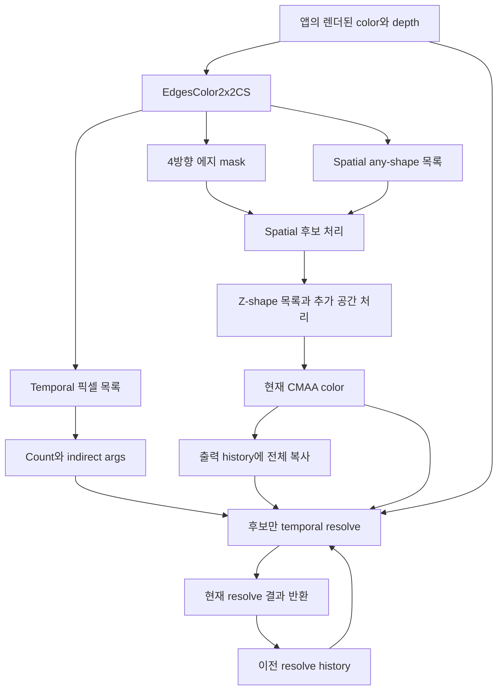

# 확보한 TSCMAA 소스의 전체 처리 구조와 핵심 알고리즘 분석

작성일: 2026-09-14. 분석 기준: `research/tscmaa-source-audit`, renderer 기준 커밋 `98b3583`.

## 1. 목적과 이번 작업의 범위

장기 목적은 논문을 위한 실시간 SMAA 최적화 연구다. 기존 luma 대비 기반 Adaptive SMAA의 공간 탐색 최적화를 기반으로 temporal 개선 가능성을 연구하고 있다. 이번 단기 작업은 미래설계학점 계획의 **2주차: 확보한 TSCMAA 소스 코드의 처리 구조 및 핵심 알고리즘 분석**에 해당한다.

공개 자료로 추정했던 구현과 실제 확보 소스를 구분하고, 한 프레임의 입력부터 다음 프레임 history까지 설명할 수 있도록 분석했다. 기존 SMAA 구현과의 본격적인 적용 설계는 3주차 범위로 남긴다. 이번 작업은 소스 읽기, 공개 PDF 대조, 보존된 산출물의 해시 재확인 및 symbolic 상태 추적이다. 셰이더 재컴파일, GPU 검사 재실행, 데모 실행, 품질·성능 측정, renderer 수정은 수행하지 않았다.

이 문서에서 사용하는 증거 표시는 다음과 같다.

| 표시 | 의미 |
|---|---|
| **소스 확인** | 확보한 파일의 활성 코드·바인딩·호출 순서에서 직접 확인 |
| **기존 검사** | 2026-09-10에 수행한 검사 결과를 이번에 검토 |
| **정적 추론** | 소스의 데이터 흐름에서 도출했으나 실제 GPU/화면에서 재현하지 않음 |
| **미검증** | 원본 실행, 전체 mask, 수치 reference 또는 외부 출처 확인이 추가로 필요 |

**핵심 결론:** 이 소스는 CMAA 공간 처리를 수행한 뒤 선택된 픽셀에만 temporal 처리를 적용한다. 두 후보 목록을 같은 에지 검출에서 만들며, temporal 결과가 다음 history로 순환한다. 다만 host 연결·초기화·표시 경로에는 알고리즘 설명과 별도로 검사해야 할 문제가 있다. 소스가 확보되었다는 사실은 전체 sample의 정확성 검증 완료를 뜻하지 않는다.

## 2. 소스 동일성과 분석 대상

확보 소스 루트는 `C:/Users/USER/Desktop/project/AASample`이다. 아래 `Intel/...`, `Sample/...`, `build_dep/...`는 모두 이 외부 루트 기준이다. 연구 저장소 자체의 경로는 `Projects/CMAA2/...` 또는 `Docs/...`로 구분한다.

- 이전 추출본: `C:/Users/USER/Desktop/research/tmp/tscmaa-source-audit-20260910`.
- 이전 `audit.json`에 기록된 텍스트 소스·프로젝트 파일 **25/25개**가 현재 AASample과 SHA-256 일치했다.
- 현재 AASample의 RGB/BGR `.hcs` 바이트 배열 **12/12개**가 이전에 보존한 supplied 및 compiled DXBC 양쪽과 일치했다. 이번에 컴파일한 결과가 아니다.
- 이전 literal LCA 검사의 독립 두 실행 binary도 다시 비교하여 일치했다.
- 이번 보조 기록: `tmp/tscmaa-week2-20260914/evidence.json`. 임시 생성 코드·PDF 렌더 이미지·binary는 커밋 대상에서 제외한다.
- 배포 ZIP이 수정 없는 Intel 배포본인지, 동봉 EXE/LIB가 이 C++ 소스와 일치하는지는 여전히 미검증이다. 본문에서는 **확보 소스**라고 표현한다.

핵심 파일과 역할:

| 약칭 | 파일·주요 시작 줄 | 역할 |
|---|---|---|
| Host | [TSCMAA.cpp](C:/Users/USER/Desktop/project/AASample/Intel/TSCMAA/TSCMAA.cpp:1044) | 리소스, 상수, spatial/TAA 실행, history·계측 |
| API | [TSCMAA.h](C:/Users/USER/Desktop/project/AASample/Intel/TSCMAA/TSCMAA.h:37) | ColorDepthIn, 기본값, 상태, 외부 API |
| Edge | [CMAA.hlsl](C:/Users/USER/Desktop/project/AASample/Intel/CMAA/CMAA.hlsl:350) | 에지·후보 선별, spatial any/Z 처리, 공통 dispatch args |
| Temporal | [TAA_Edge.hlsl](C:/Users/USER/Desktop/project/AASample/Intel/TAA/TAA_Edge.hlsl:77) | 후보별 재투영·history 처리·결합 |
| Utility | [Util.hlsl](C:/Users/USER/Desktop/project/AASample/Intel/Util/Util.hlsl:110) | bicubic, YCoCg, clipping, velocity, packing |
| Desktop | [AntiAliasingStandalone.cpp](C:/Users/USER/Desktop/project/AASample/Sample/AASample/AntiAliasingStandalone.cpp:1747) | 앱 입력 생성·desktop 렌더·표시 |
| OpenVR | [AntiAliasingOpenVR.cpp](C:/Users/USER/Desktop/project/AASample/Sample/AASample/AntiAliasingOpenVR.cpp:527) | eye별 카메라, jitter, HMD 제출 |
| WMR | [AntiAliasingWmr.cpp](C:/Users/USER/Desktop/project/AASample/Sample/AASample/AntiAliasingWmr.cpp:730) | WMR eye별 카메라·제출 |

### 2.1 실제 빌드 경로

`Intel/TSCMAA/TSCMAA_Edge.hlsl:16–20`은 `CMAA2_USE_TYPED_UAV_STORE=0`을 정의하고 Edge, Utility, Temporal을 include한다. `Intel/shader_inc/GenerateComputeShaderHeaders.bat:8–20`은 RGB/BGR 각각 6개 `cs_5_0` entry point를 생성한다. `DEFCLRAPPLY`를 정의하지 않으므로 Temporal의 `#else` 경로가 대상이다.

Host `604–696`은 내장된 shader byte array로 compute shader를 생성한다. `Intel/TSCMAA.vcxproj:26–44`의 HLSL 항목은 빌드에서 제외되어 있다. 따라서 **HLSL만 고치고 라이브러리를 빌드해도 동봉 `.hcs`가 자동 갱신된다고 가정하면 안 된다.** 이번 작업에서는 어느 쪽도 수정하지 않았다.

## 3. 한 프레임의 실행 순서



그림의 마지막 feedback 화살표는 **다음 프레임**을 뜻한다. depth는 후보 선정이 아니라 temporal reprojection에 사용한다. color는 후보 검출 시 AA 이전 영상이고, 공간 처리 후에는 같은 texture의 내용이 CMAA 결과로 바뀐다.

| 순서 | 실제 호출 | 읽기·쓰기 및 의미 |
|---:|---|---|
| 1 | `MySample::Render` → `RenderTSCMAA` | 앱 post-process 결과와 현재 depth, view/projection 준비 |
| 2 | public `TSCMAA::Draw`, Host `853–868` | 입력 pointer와 eye 검사 후 내부 Draw, 종료 후 `GetTexture(eye)` 반환 |
| 3 | Host `1057–1072` | threshold/removal/bluriness와 행렬 상수 갱신, history index 전환 |
| 4 | Host `1082–1095` | append counter 초기화, 전체 화면 에지 검출, spatial/TAA 목록 동시 생성 |
| 5 | Host `1117–1137` | spatial count 복사 → args 생성 → any-shape indirect 처리 |
| 6 | Host `1148–1170` | Z count 복사 → args 생성 → Z-shape indirect 처리 |
| 7 | Host `1177–1193` | 선택적 debug edge draw. 일반 결과 분석에서는 비활성화해야 함 |
| 8 | Host `1204–1210` | 현재 CMAA color 전체를 이번 출력 history에 `CopyResource` |
| 9 | Host `1218–1241` | 이전 history·depth·현재 CMAA 이웃 바인딩 → TAA count/args → 후보만 resolve |
| 10 | `GetTexture`, Host `481–490` | 현재 출력 history texture 반환. 다음 Draw에서 이 결과를 history로 읽음 |

`ResetPipelineState`는 SRV/UAV 충돌을 피하도록 바인딩을 해제하는 함수다. **temporal history 내용을 초기화하는 reset 함수가 아니다.**

## 4. 입력, texture format, SRV/UAV의 실제 관계

### 4.1 앱이 넘기는 입력

Desktop `829–841`은 `mpSceneColor2`와 `mpDepthBufferRT`로 `ColorDepthIn`을 만들고 TSCMAA를 생성한다. color는 32-bit RGBA/BGRA typeless이며 SRGB RTV와 R32_UINT UAV를 사용한다(`671–700`). 일반 렌더 경로에서는 post-process 후 TSCMAA를 호출한다(`1959–1984`). 따라서 이 sample의 TSCMAA 입력을 원시 HDR lighting texture라고 표현하지 않는다.

API `48–174`는 같은 color texture에 UNORM/SRGB SRV 및 R32_UINT UAV를 만든다. depth는 지원 형식에 따라 R32_FLOAT, R24_UNORM_X8_TYPELESS, R32_FLOAT_X8X24_TYPELESS SRV를 구성한다. 선언된 format 분기를 확인한 것이며 모든 형식의 장치 호환성 실행 검사는 아니다.

### 4.2 데이터가 바뀌는 시점

| 리소스 | 물리적 정체·format | 내용 |
|---|---|---|
| `ColorSRV_UNORM` / `ColorUAV` | **같은** 앱 color texture의 UNORM SRV / R32_UINT UAV | edge pass에서는 입력 color, spatial pass 후에는 CMAA 결과 |
| `m_edgesTexture[eye]` | full-resolution R8_UINT | 오른쪽·아래·왼쪽·위 4bit edge mask |
| spatial any/Z 목록 | structured uint append buffer | 좌표와 shape flags |
| TAA 목록 | 별도 structured uint append buffer | temporal 대상으로 선별된 좌표 |
| `m_controlBuffer[eye]` | R32_UINT UAV, indirect-args buffer | group counts 및 유효 후보 count, pass마다 재사용 |
| `m_pHistoryTex[2][eye]` | typeless RGBA/BGRA, UNORM SRV, R32_UINT UAV | 이전 resolve와 현재 출력, 두 장을 교대 사용 |

Temporal 바인딩은 다음과 같다(Host `1218–1232`).

| slot | 연결 |
|---|---|
| `t2` | TAA candidate list |
| `t3` | 이전 history의 UNORM SRV |
| `t4` | 현재 depth SRV |
| `t5` | 현재 CMAA 결과가 들어 있는 `ColorSRV_UNORM` |
| `u0` | CMAA 결과를 미리 복사한 현재 출력 history |
| `u3` | 공통 control buffer |
| `s0` / `s1` | point BORDER / linear BORDER, border RGBA=(0,0,0,0) |
| `b1` / `b3` | 행렬 / width·height |

이 때문에 Temporal의 중심 color는 출력 UAV에서 읽지만, clipping 이웃은 별도의 현재 CMAA color texture에서 읽는다. 이웃을 같은 temporal 출력 UAV에서 읽으며 누적시키는 구조가 아니다. 비후보는 복사된 CMAA 결과를 유지한다. 다만 후보 목록의 범위 밖 처리 문제까지 없다는 보장은 별도 검증이 필요하다.

## 5. 에지 검출과 temporal 후보의 정확한 식

### 5.1 표본과 데이터 재사용

`EdgesColor2x2CS`의 thread group은 16×10이다. 각 thread는 2×2 중심 픽셀을 맡고, offset `(0,0),(1,0),(2,0),(0,1),(1,1),(2,1),(0,2),(1,2)`의 **8개 color texel**을 읽는다. 각 픽셀에서 오른쪽·아래 방향 차이를 만들고 group shared memory에 저장한다(Edge `350–398`).

group 외곽 한 thread 폭은 halo다. 내부 14×8 thread가 각각 2×2를 출력하므로 명목 출력 tile은 28×16 pixel이다. 실제 화면 끝의 유효 범위 검사는 §12에서 별도로 다룬다. `GroupMemoryBarrierWithGroupSync` 전후의 shared 재사용으로 주변 응답을 모은다. '한 픽셀의 8방향 탐색'이나 '색을 8번 읽어 temporal만 검출'하는 것으로 설명하면 부정확하다.

### 5.2 색 차이와 threshold subtraction

Edge `298–302`의 활성 연산은 다음과 같다.

```text
D(A,B) = max(0.299·|Ar-Br|, 0.587·|Ag-Bg|, 0.114·|Ab-Bb|)
ex(p) = saturate(D(C(p), C(p+(1,0))) - T)
ey(p) = saturate(D(C(p), C(p+(0,1))) - T)
T = 1/22 (기본값)
```

코드의 `LumWeights`라는 이름과 달리 가중 RGB 합으로 luma를 계산한 뒤 차이를 내는 식이 아니다. 수식은 실수 의미를 설명하며, 실제 계산에는 `CMAAPrecision.hlsl:18–28`의 min16float 계열이 포함된다. 순서·형변환을 무시한 float64 식을 GPU와 byte-exact라고 부르면 안 된다.

### 5.3 연결된 수직 에지 평균에 의한 억제

화면 좌표에서 x는 오른쪽, y는 아래쪽이다. 위의 threshold 적용 후 응답을 사용하면 `DoLocalContrastAdaptation`(Edge `339–345`)은 다음처럼 쓸 수 있다.

```text
Mx(p) = [ey(p+(0,-1)) + ey(p) + ey(p+(1,-1)) + ey(p+(1,0))] / 4
My(p) = [ex(p+(-1,0)) + ex(p) + ex(p+(-1,1)) + ex(p+(0,1))] / 4
ex'(p) = saturate(ex(p) - r·Mx(p))
ey'(p) = saturate(ey(p) - r·My(p))
r = 0.5 (기본값)
```

평균 대상은 주변 RGB가 아니라 **연결된 수직 방향 에지 응답 네 개**다. `r`을 증가시키면 상대적으로 약한 응답을 더 억제한다. 이전 literal-call LCA GPU 검사 256 fixture는 이 부분 함수의 방향 매핑을 확인했으나, 전체 shared-memory 경로를 검증한 것은 아니다.

### 5.4 네 방향 재조합과 서로 다른 두 목록

Edge `450–490`은 오른쪽·아래·왼쪽·위 응답을 모은다.

```text
ce(p) = [ex'(p), ey'(p), ex'(p+(-1,0)), ey'(p+(0,-1))]
b = ce > 0
spatialList(p) = (bR·bD + bD·bL + bL·bU + bU·bR) > 0
temporalList(p) = any(ce > T/2)
```

spatial any-shape 목록은 인접한 방향 에지 쌍을 요구한다. TAA 목록은 추가 threshold를 넘은 방향이 하나라도 있으면 된다. 예를 들어 강한 한 방향만 있으면 TAA 후보가 될 수 있지만 any-shape 목록에는 들어가지 않는다. 그러므로 **TAA 목록을 spatial any-shape 목록의 부분집합이라고 설명하면 안 된다.** 두 목록은 같은 검출 응답에서 서로 다른 조건으로 만들어진다.

추가 `T/2`는 이미 threshold subtraction과 suppression을 거친 residual에 적용한다. 주변 억제가 0일 때에만 `D > 1.5T`로 단순화할 수 있다. 코드에는 픽셀의 절반을 무작위 추출하거나 상위 50%를 정렬해 선택하는 quota가 없다.

## 6. 선별, append, count, indirect dispatch의 구분

1. **선별:** §5의 predicate가 어느 픽셀을 처리할지 결정한다.
2. **append/compact:** 선택된 좌표를 uint 목록에 넣는다. 목록 저장 순서는 전역 화면 순서라고 가정하지 않는다.
3. **count:** D3D11 append counter를 `CopyStructureCount`로 control buffer의 byte offset 12, 즉 `[3]`에 복사한다.
4. **args 생성:** `ComputeDispatchArgsCS`는 연결된 목록 capacity로 count를 제한하고 `[ceil(count/128),1,1,count]`를 기록한다(Edge `500–514`).
5. **실행:** `DispatchIndirect`는 첫 세 uint를 읽어 128-thread group을 시작한다. 각 thread가 후보 좌표를 복원한다.

`EncodeCandidateInfo`(Edge `318–333`)는 `flags | (x<<14) | y`로 pack하며 decode는 x/y를 각각 15/14bit로 마스킹한다. TAA에서는 shape flags가 모두 false다. 기존 SMAA 쪽의 16/16bit 좌표 packing과 혼동하지 않는다.

공통 t2/u2의 **바인딩 대상은 pass마다 달라진다.** args shader의 `g_pixelCandidatesReadonly`라는 이름은 spatial 전용이라는 의미가 아니다. TAA args 생성 시 t2에는 TAA 목록이 연결되어 그 capacity를 읽는다.

Host `875–876`의 nominal capacity는 spatial any/Z 각각 `width*height/4`, TAA는 `width*height/2`다. 이것은 메모리 할당량이며 후보 비율 측정치가 아니다. args count clamp도 앞서 발생한 append overflow를 복원하지 않는다.

## 7. Spatial CMAA 처리는 무엇을 하는가

`ProcessCandidatesCS`(Edge `708–944`)는 후보 주변의 4방향 edge mask로 shape를 구분한다. 가로·세로 Z 가능성을 비교하고, Z로 분류된 후보는 flags와 함께 별도 목록에 append한다. 그 외 단순 shape는 인접 색과 혼합한다.

단순 shape의 기본 계수는 Host에서 `bluriness * 0.11`, 기본값으로는 `0.7 * 0.11 = 0.077`이다. edge 방향에 따라 이웃 가중치를 만들고, 이웃 가중합을 `fourWeightSum+0.0001`로 나눈 뒤 중심 color와 혼합한다. 중심 비율은 `1/(1+fourWeightSum)`이다. 실제 shader는 epsilon을 포함하므로 이상적인 정규화 식과 완전히 같다고 단순화하지 않는다.

`ProcessZCandidatesCS` → `ProcessDetectedZ`(Edge `604–672,947–970`)는 line length를 탐색하고 방향·반전 여부에 맞게 인접 색을 혼합한다. Z 경로의 혼합량에는 `min(abs(k),0.42)` 제한이 있다. 이 단계까지 완료한 color가 temporal current 입력이다.

이 공간 처리의 shape 판별·탐색·가중치는 SMAA의 edge → blending weight → neighborhood blending과 다른 구조다. 이번 문서는 TSCMAA의 temporal 입력이 만들어지는 순서를 분석한 것이며, CMAA spatial 품질이나 모든 shape 계산의 CPU/GPU 동등성을 인증하지 않는다.

## 8. Reprojection: 셰이더 식과 host가 실제로 넘기는 행렬

### 8.1 셰이더 계산

Temporal `81–103`, Utility `218–246`에서 pixel center UV와 depth를 사용한다. row-vector 표기에서:

```text
u = (pixel + 0.5) / (width,height)
q = (2u.x-1, 1-2u.y, depth, 1)
worldH = q · currProjInv · currViewInv
world = worldH / worldH.w
previousH = world · prevView · prevProj
previousNDC = previousH / previousH.w
velocity = (q.xy - previousNDC.xy) · (0.5,-0.5)
historyUV = u - velocity
```

이 계산은 camera/depth 기반이다. object world transform, object motion-vector texture, 이전 depth를 이용한 disocclusion rejection 입력은 없다. 함수에 명시적인 화면 밖 UV 거부·w 유효성 검사도 없으며, sampling은 검정 BORDER를 사용한다. UV가 화면 안이어도 bicubic/clipping footprint 일부가 경계를 넘을 수 있다.

### 8.2 이번에 확인한 host 연결 차이

Host `378–400`에서 `rotStartMat`은 저장된 history View를 읽지만 `projectionMat`은 **현재 함수 인자 projection**을 읽는다. 그리고 `prevProj`에도 그 현재 `projectionMat`을 넣는다. 저장된 `TAAResource.Projection`은 이 계산에 읽히지 않는다.

따라서 steady-state에서도 정확한 설명은 **이전 View + 현재 Projection, 현재 View/Projection의 역행렬**이다. projection이 고정되어 있으면 이전 projection과 현재 projection이 같을 수 있지만, FOV·aspect·jitter 변화가 있는 경우에는 같은 의미가 아니다. 이 사실만으로 실행 중 오류의 크기를 산출할 수는 없다.

또한 첫 두 호출에는 §11의 View slot 초기화 문제가 있어 steady-state 설명을 그대로 적용할 수 없다.

## 9. History sampling, clipping, blending

### 9.1 5-tap bicubic 근사

Utility `110–154`는 historyUV에서 `pixel=UV*size+0.5`, `t=frac(pixel)`, `P=(floor(pixel)-0.5)/size`를 계산한다. 각 축의 cubic 계수는 `s=0.5`일 때 다음과 같다.

```text
w0 = -s*t³ + 2s*t² - s*t
w1 = (2-s)*t³ + (s-3)*t² + 1
w2 = (s-2)*t³ + (3-2s)*t² + s*t
w3 = s*t³ - s*t²
s0 = w1+w2
f0 = w2/(w1+w2)
m0 = P + f0/size
```

linear sampling 다섯 개는 위 A, 왼쪽 B, 중심 C, 오른쪽 D, 아래 E의 cross 배치다. 바깥 축 좌표는 `P-1/size`, `P+2/size`이며 중심 축은 `m0`다. 실제 최종 결합식은 다음과 같다. **첫 행의 `(A+B)` 반복도 확보 소스 그대로**다.

```text
H = [0.5(A+B)w0.x + A*s0.x + 0.5(A+B)w3.x]w0.y
  + [B*w0.x + C*s0.x + D*w3.x]s0.y
  + [0.5(B+E)w0.x + E*s0.x + 0.5(D+E)w3.x]w3.y
```

정확한 separable 16-tap 필터나 기존 SMAA adaptation의 normalized cross-5와 동일한 식이 아니다. 기존 검사에서 단색 보존과 좌우 비대칭이 함께 관측됐다. 비대칭이 의도인지 오타인지는 미확정이다.

### 9.2 Clipping이 실제로 수행되는 공간

Utility `9–25`의 변환:

```text
Y  = 0.25R + 0.5G + 0.25B
Co = 0.5R - 0.5B
Cg = -0.25R + 0.5G - 0.25B
R = Y+Co-Cg; G=Y+Cg; B=Y-Co-Cg
```

`ClipColor`(Utility `158–214`)는 현재 CMAA 이웃 8개와 중심을 YCoCg로 바꾼다. 중심에만 다음 처리를 적용한다.

```text
corners = (왼쪽위 + 오른쪽위 + 왼쪽아래 + 오른쪽아래)/4
center' = max(0, center + a*(center-corners))
a = 0.263157904
mu = sum(8 neighbors + center')/9
sigma = sqrt(sum(squares)/9 - mu²)
lower = YCoCg2RGB(mu-sigma)
upper = YCoCg2RGB(mu+sigma)
clippedHistory = clamp(historyRGB, lower, upper)
```

즉 **통계는 YCoCg에서 계산하지만 마지막 clamp는 RGB에서 수행**한다. YCoCg box 안에서 history를 직접 clip하는 것으로 표현하면 실제 연산을 놓친다. 중심 sharpen은 최종 current color 자체를 교체하는 처리가 아니라 clipping 통계를 바꾸는 처리다.

주의점은 세 가지다. Co/Cg는 음수일 수 있으므로 `max(0,center')`가 단색에서도 중심을 바꿀 수 있다. 변환된 두 endpoint가 RGB의 올바른 하한·상한이라는 보장도 없다. `sqrt` 전 음수 roundoff clamp도 없다. 이전 검사에서 빨강·파랑 변화가 관측되었지만 최종 화면 품질 영향은 측정하지 않았다.

### 9.3 색 공간, 가중치, 8-bit 저장

filter와 clipping은 UNORM SRV 값에서 수행된다. 그 뒤 Temporal `112–117`은 활성 history weight `w=0.789473712`로 결합한다. Edge `63–65,142–174`에서 활성화한 근사 decode/encode를 이상적인 실수 식으로 쓰면:

```text
resultRGB = sqrt(w*clippedHistoryRGB² + (1-w)*currentCMAARGB²)
```

이것은 IEC sRGB의 정확한 piecewise 변환이 아니다. 변환 helper는 lpfloat 계열을 포함하며, 최종 `PackColorFF`도 saturate·255 배율·반올림 및 lpfloat 전달을 거친다. RGBA/BGRA packing을 구분하고 alpha는 current pixel에서 유지한다. CPU float64 한 줄 식만으로 최종 byte를 재현했다고 주장하지 않는다.

noncandidate에는 resolve가 쓰지 않으므로 copy된 현재 CMAA color가 남는다. candidate의 weight는 속도나 신뢰도에 따라 조절되는 동적 값이 아니라 활성 경로에서 상수다. `opaque=1`도 실제 coverage/opacity 판별식이 아니다.

## 10. Jitter와 최종 표시 경로: 라이브러리 밖의 동작

### 10.1 Jitter는 caller별로 다르다

OpenVR `527–559`, WMR `730–764`에는 checkbox와 TSCMAA 선택 조건에 따른 64-entry offset table 기반 projection jitter가 있다. table은 `AntiAliasingStandalone.h:74–141`에 정의되어 있으며 Halton sequence 주석이 있다. 활성 frame에서 `frameSub=(frameSub+1)%64`로 진행한다. SMAA T2X의 2-frame paired subsample pattern이 아니다.

다만 **분기가 존재한다는 사실과 정상 실행에서 활성화된다는 사실은 다르다.** Desktop의 공통 `MySample::Update`(`1214–1231`)는 TSCMAA 선택 시 checkbox를 unchecked로 바꾸고 비활성화한다. OpenVR `818`, WMR `1026`도 이 공통 Update를 호출한다. 따라서 정상 Update 후 렌더 흐름에서는 deliberate jitter가 꺼지는 것으로 읽히며, checkbox 생성 시 checked 기본값(`605`)만으로 jitter On이라고 기록하면 안 된다. 첫 Update 이전·다른 호출 순서·다른 빌드의 실제 동작은 미검증이다.

만약 위 조건부 jitter 분기를 활성화한다면, 렌더 카메라에는 jitter를 더한 eye projection을 설정하지만 TSCMAA 호출은 base `ovr_eyeProjectionMatrix[eye]` / `wmr_eyeProjectionMatrix[eye]`를 넘긴다(OpenVR `699`, WMR `892`). 따라서 그 경로의 rasterization 좌표와 reprojection 행렬 대응은 별도 검증이 필요하다. 라이브러리 자체는 jitter sequence를 생성하지 않는다.

Desktop `Render`에서는 같은 64-entry jitter 적용을 찾지 못했다. 체크박스가 있다는 이유만으로 모든 실행 경로에 jitter가 켜졌다고 해석하지 않는다. 또한 `float2 jitterVector;`는 CPUT `float2()`가 `(0,0)`으로 초기화하므로, 조건문 밖 선언만 보고 미초기화 버그라고 판단하면 안 된다(`build_dep/CPUT/CPUT/CPUTMath.h:66`).

### 10.2 Desktop 화면과 VR 출력이 같지 않다

public Draw는 현재 resolve texture를 `pOutTex`로 반환한다. 그러나 Desktop `1980–2021`은 반환을 받은 뒤 일반 표시 경로에서 `mpResolveMaterial`을 사용한다. 이 material은 `ResolveTarget.mtl:1`의 `texture0=$SceneColor2`를 읽으며, `ResolveSprite.fx:75–77`은 그 texture를 sample한다.

**소스 연결상 일반 Desktop 표시 경로는 현재 CMAA color를 표시하고, 반환된 temporal texture를 표시 입력으로 사용하지 않는다.** 라이브러리는 temporal 계산을 수행할 수 있어도 화면에 그 결과가 표시된다고 자동으로 결론낼 수 없다. dual-resolution 특수 분기와 실제 동봉 EXE의 화면은 이번에 실행 검증하지 않았다.

반면 OpenVR `769–772`, WMR `965–968`은 TSCMAA 선택 시 `pOutTex`를 HMD 제출에 사용한다. VR mirror의 일반 resolve sprite와 HMD 제출도 구분해야 한다. 앞으로 출력 검증은 창 캡처보다 **public Draw가 반환한 texture를 직접 확인하는 경로**부터 수립할 필요가 있다.

## 11. History lifecycle과 초기 두 프레임

### 11.1 정상 교대의 의미

API `354–358`은 eye별 `historyFrame=0`, `initialized=false`와 두 matrix slot을 가진다. `CreateTAAConstBuffers`는 호출마다 historyFrame을 XOR 1로 바꾸고 `historyIdx=historyFrame`, `renderIdx=historyFrame^1`로 선택한다. 각 eye가 순차적으로 호출되는 구조이며 index와 matrix는 실제 호출에 따라 진전한다.

`GetTexture`는 renderIdx를 반환한다. 반면 deprecated `GetHistoryTexture`는 historyIdx를 반환하므로 같은 프레임의 결과와 이전 입력 history를 혼동하지 않는다.

### 11.2 첫 프레임은 current seed가 아니다

Base Resize `270–272`는 두 history texture를 흰색으로 clear한다. 내부 Draw에는 first-frame temporal resolve를 건너뛰거나 두 history를 current spatial로 seed하는 분기가 없다. 따라서 첫 호출의 후보는 흰색 history를 sampling·clipping·blending 경로로 보낸다. clipping이 있으므로 최종 화면이 단순히 흰색 79%로 섞인다고 계산하면 안 된다.

`m_initialClearNeeded=true`는 존재하지만 확인한 파일에서 이 값을 읽어 history seed를 수행하는 코드는 없다.

### 11.3 View 저장 slot의 첫 두 호출 추적

Host `365–374`는 첫 호출에 **historyIdx에만** View를 기록하고, 이후 호출에는 renderIdx에 기록한다. 이 분기대로 symbolic하게 추적하면:

| eye의 호출 번호 | historyIdx | renderIdx | prevView로 읽는 값 | 현재 View 저장 위치 | history texture 입력 |
|---:|---:|---:|---|---|---|
| 1 | 1 | 0 | V1 | slot 1만 기록 | 흰색 clear |
| 2 | 0 | 1 | **이 코드에서 아직 기록하지 않은 slot 0** | slot 1=V2 | 직전 R1 |
| 3 | 1 | 0 | V2 | slot 0=V3 | 직전 R2 |
| 4 | 0 | 1 | V3 | slot 1=V4 | 직전 R3 |

`TAAResource()`는 빈 생성자다(API `294`). 이 추적은 **두 번째 호출의 prevView가 이전 카메라 View로 준비되지 않는 데이터 흐름**을 확인한다. 해당 메모리가 0인지 다른 값인지, 어떤 GPU 출력이 나오는지는 저장 기간·초기 메모리 상태에 따라 달라질 수 있으므로 정하지 않았다. 위 표는 GPU 실행 결과가 아니다.

### 11.4 Resize와 재사용

Base Resize는 history texture를 새로 만들고 흰색으로 clear하지만 `historyFrame`/`initializedEyeHistoryTex`를 재설정하지 않는다. `ReleaseTextures`(Host `315–328`)는 history texture/view를 해제하지 않으며, Resize는 기존 history pointer를 새 생성 결과로 덮어쓴다. history 해제는 Destroy에만 있다. 기존 history 참조와 `GetImmediateContext` 참조의 해제 누락 가능성도 있다. 반복 resize의 실측 누수량은 미검증이다.

상위 `TSCMAA::Resize`는 base Resize의 반환값을 확인하지 않고 새 작업을 이어가며(`745–750`), immutable buffer도 기존 것을 release하는 호출 없이 재생성한다(`788–807`). Destroy 후 같은 인스턴스에 Create를 다시 호출할 때도 history flags를 초기값으로 돌리는 코드가 확인되지 않았다.

앱 `MySample::ResizeWindow`는 scene color/depth를 재생성하지만 `ColorDepthIn` 재연결과 `mTSCMAA.Resize` 호출이 없다(Desktop `1677–1739`). CPUT `RecreateRenderTarget`은 실제 native texture를 해제·재생성한다(`CPUTRenderTarget.cpp:306–340`). 따라서 초기 Create 이후 이 경로가 실행되면 **이전 texture를 가리키는 ColorDepthIn view와 새 렌더 대상이 어긋날 수 있다.** API 제공과 sample의 올바른 호출은 별개다. 실제 resize/VR 시작 시점의 오류를 재현한 것은 아니다.

camera cut, scene 변경, AA mode에서 나갔다가 돌아오는 경우의 명시적 history invalidation API도 이 라이브러리에서 찾지 못했다. 기존 SMAA 연구의 reset lifecycle 검증 결과를 이 확보 sample의 검증으로 가져오지 않는다.

## 12. 경계·안전성 및 아직 실행하지 않은 검사

| 항목 | 코드 근거 | 판단과 한계 |
|---|---|---|
| TAA tail thread | Temporal `161–164` | list를 먼저 읽고 `threadID > count`로 거부. 양수 nonmultiple-of-128에서 index==count도 통과. 기존 CPU count 분석이며 위험한 GPU 실행은 안 함 |
| Spatial any tail | Edge `710–718` | `> count`이면 return 대신 `pixelID=0`으로 바꿔 계속 실행. TAA와 같은 동작이라고 요약하면 안 됨. 추가 origin 접근·write 가능성은 정적 분석 |
| Spatial Z tail | Edge `949–953` | load 전 검사지만 `>`이므로 index==count 통과 |
| append capacity | Host `875–876`, Edge `503–514` | count clamp는 append 초과를 복원하지 못함. capacity·overflow runtime gate 필요 |
| tile·shared 경계 | Edge `405–443,446–490` | 소스 주석도 halo의 shared OOB 가능성을 인정. 출력 분기는 tile 내부 여부이며 화면 width/height 검사와 같지 않음. 전체 edge/mask 실행 검사 필요 |
| shared-memory 순서 | Edge `398–443` | LCA 이웃 read와 자기 영역 write가 같은 구간에 있음. group 내 순서·경계까지 포함한 전체 결과 결정성 미검증 |
| control 초기 데이터 길이 | Host `177–192` | 8 uint buffer에 4 uint 초기 배열을 전달. 선언 크기 불일치 확인. 호스트 범위 밖 읽기 위험을 실측한 것은 아님 |
| history View 첫 두 호출 | Host `358–400` | §11의 slot 작성 순서 문제. symbolic 추적, GPU 재현 전 |
| 이전 projection | Host `380,400` | current projection을 prevProj로 전달. 가변 projection과 jitter 정합성 gate 필요 |
| filter·clipping | Utility `150–152,192–211` | 기존 부분 함수 GPU 검사에서 비대칭·단색 변화 확인. 최종 packed resolve 영향 미검증 |
| history UV | Utility `227–246`, Host `112–131` | w 유효성/화면 밖 명시적 reject 없이 BORDER sampling. 경계·disocclusion 검증 필요 |
| resource lifecycle | §11.4 | 재연결·상태 reset·해제·오류 반환 전파 확인 필요 |
| desktop 표시 | §10.2 | 일반 material은 `$SceneColor2` 사용. 반환 texture와 화면의 실제 hash 비교 필요 |

이번에는 의심되는 식을 수정하거나 원본의 overflow/OOB 경로를 GPU에 실행하지 않았다. 안전성 수정은 3주차 설계에서 원본 대비 변경으로 명시하고, 4–5주차 구현·검증에서 분리한다.

## 13. GPU 계측 범위

Host `1075–1199`의 CMAA timestamp는 에지 검출, spatial args 및 any/Z 처리, 조건부 debug draw를 둘러싼다. Host `1209`의 history 전체 복사는 CMAA 종료 후, TAA 시작 `1215` 전이다. **CMAA 합계와 TAA 합계를 단순 합산해도 이 copy 비용은 빠진다.**

TAA timestamp는 후보 count 복사, args 생성, indirect resolve를 포함한다(`1215–1246`). 행렬 상수 준비, 앱 렌더·post-process·표시/HMD 제출, copy와 종료 후 readback까지 포함하는 전체 frame 지표가 아니다.

`TSCMAA_GPUSTATS`는 API `26`에서 기본 주석 처리되어 있다. 활성화할 경우 종료 후 `CopyStructureCount`/blocking Map 및 query 대기가 들어간다(Host `1255–1285`). 기록되는 `numEdgePixels`는 **spatial any-shape append count**이며 모든 edge pixel의 수나 TAA 후보 수가 아니다. 후보 비율의 분모를 맞춰야 한다. `CheckForDisjointQuery`에는 Sleep 반복이 있고 이 함수 자체의 wall-clock timeout은 없다.

이번 결과로 원래 공개 성능 수치의 측정 조건 전체를 확정하지 않는다. 우리 프로젝트에서는 전체 AA, 후보 생성, temporal resolve, 모든 copy를 포함하는 범위를 명시하고 PNG·readback과 성능 측정을 분리하는 기존 원칙을 유지한다.

## 14. 공개 문서와 확보 소스의 대응

공개 기준은 Sungye Kim, Intel, [*Temporally Stable Conservative Morphological Anti-Aliasing*, code sample v1](https://www.intel.com/content/dam/develop/external/us/en/documents/tscmaa-codesample-v1.pdf)이다. PDF 실제 제목은 이 이름이며, 기존 구현 계획의 `Temporal & Spatial Concurrent...` 표기는 이 PDF의 제목으로 사용하지 않는다. 페이지는 PDF 첫 장부터 1로 센다. pp.2–4의 본문·도식을 이미지로도 확인했다.

| 문서 위치·요지 | 확보 소스 대응 | 판정 |
|---|---|---|
| p.2 Fig.1: CMAA 후 선택적 TAA, feedback | Host 실행 순서·두 history texture | 큰 구조 대응 |
| p.3: luminance difference, threshold 1/22 | Edge의 weighted-RGB max, API 기본값 | threshold 대응, luma 합의 차이로 해석 금지 |
| p.3: sample의 TAA 후보 약 50% | residual predicate, 독립 append 목록 | 고정 quota·buffer 절반 용량과 구분 |
| p.4: depth 재투영·5-tap | Utility 및 Temporal | 구조 대응, host의 prevProj는 current 값 |
| p.4: YCoCg variance clipping | YCoCg 통계 후 RGB clamp | 구현 세부 구분 필요 |
| p.4: history 0.8, 비후보 0 | 활성 0.789473712, 비후보 copy 유지 | 정확한 상수 차이 |
| p.9: removal 0.5, bluriness 0.7 | API Settings·Host constant | 기본값 대응 |

위 표 밖의 구체적인 식·초기화·표시 경로 판단은 공개 문서의 요약이 아니라 **확보한 로컬 소스 분석**에 근거한다. 문서에 없는 세부를 문서가 보장한다고 표현하지 않는다.

## 15. 기존 검사와 이번 추가 분석을 분리한 검증표

| 영역 | 2026-09-10의 기존 결과 | 이번 2026-09-14 작업 | 남은 범위 |
|---|---|---|---|
| 소스·bytecode | FXC 12개 재생성과 동봉 DXBC 일치 | 현재 25 source 해시, 현재 12 header와 저장 binary 재비교 | EXE/LIB 대응·배포 출처 |
| 후보 LCA | literal 호출 256 fixture CPU/GPU 오차 0, 독립 반복 일치 | 방향 식과 전체 호출 문맥 대조, 저장 반복 binary 동일 확인 | 전체 EdgesColor2x2CS mask·shared-memory·tile 경계 |
| count | TAA `>` 경계 및 capacity CPU 분석 | spatial any/Z의 서로 다른 tail 동작 추가 추적 | 안전한 목록·overflow·process count GPU gate |
| bicubic | 상수 보존, 실제 texture 반전 최대 차이 0.00144571 | sample 좌표·결합식을 문서화 | 완전한 sampling mirror, 경계, 최종 출력 영향 |
| clipping | 빨강·파랑 단색 변화, CPU/GPU 차이 <1e-4 | sharpen→통계→RGB clamp→blend→pack 연결 | 최종 R8 output·실제 장면 영향 |
| 리소스·색 공간 | source/destination alias, UNORM/근사 blend 확인 | slot별 리소스와 변경 시점, 최종 표시 연결 | 장치별 binding/runtime validation |
| reprojection | camera/depth 구조 확인 | prevProj 실값, VR jitter/base projection 분리 | 수치·화면 경계 검증 |
| history | 전체 lifecycle 미완료 | 흰색 clear, 첫 두 View slot, resize·재사용 정적 추적 | first-frame/cut/resize/mode 전환 GPU 검증 |
| 품질·성능 | 원본 전체 평가 없음 | 새 평가 없음 | 정확성 gate 이후 동일 조건 비교 |

이전 검사 보고서에는 당시 미완료였던 항목이 다음 보고서에서 완료되는 경우가 있다. 각 보고서의 날짜·범위를 함께 해석한다. 이전 GPU 수치를 이번 주 새로 실행한 성과로 기록하지 않는다.

기존 검사 자료(로컬 작업 트리에 존재하며 당시 문서의 미커밋 상태를 유지):

- `Docs/SMAA-Recovered-TSCMAA-Source-Audit-ko.md`
- `Docs/SMAA-Recovered-TSCMAA-Bytecode-Binding-Gate-ko.md`
- `Docs/SMAA-Recovered-TSCMAA-Numeric-Probes-ko.md`
- `Docs/SMAA-Recovered-TSCMAA-GPU-Utility-Probes-ko.md`
- `Docs/SMAA-Recovered-TSCMAA-Candidate-Boundary-Gate-ko.md`

## 16. 기존 SMAA 연구와 연결할 때의 해석

현재 `IntelFamilyNonDominant`는 luma 차이, perpendicular max 억제, SMAA base-edge gate를 사용하는 adaptation이다. 확보 소스의 RGB max/threshold subtraction/mean suppression/residual 추가 threshold와 동일하지 않다. 이전 구현의 후보량·품질·성능 결과는 그 구현에 대한 결과로 보존한다.

소스와 기존 구현의 차이가 이전 수치 부진의 원인인지는 아직 미검증이다. 특히 sampler, clipping, 색 공간, jitter, feedback와 coverage를 한꺼번에 바꾼 결과로 후보 선별 단독 효과를 주장하지 않는다. source lifecycle 문제도 기존 SMAA renderer의 결함으로 옮겨 말하지 않는다.

Original/Adaptive × Standard/Edge-selective × reprojection Off/On의 기존 8-case 의미는 변경하지 않았다. 기존 `-R`은 camera/depth reprojection이며, source-based 연구가 자동으로 object motion vector를 추가하는 것은 아니다. reprojection Off인 ET2X는 계속 no-reprojection ablation으로 구분한다.

## 17. 2주차 완료 범위와 3주차 인계

**완료:** 앱 입력 → 후보 두 목록 → spatial any/Z → history copy → 후보별 reprojection/filter/clip/blend → history feedback의 소스 흐름과 실제 계산을 연결했다. 공개 문서의 설명과 코드 차이, 기존 검사, 새 정적 발견 및 미검증 항목을 구분했다. 일반 Desktop 표시와 VR 출력의 차이도 확인했다.

**완료로 표시하지 않는 항목:** 원본 전체 구현 검증, 동봉 EXE/LIB 인증, 전체 후보 mask GPU 검증, source 기반 SMAA 포팅, 새 품질·성능 개선 입증.

3주차 적용 설계에는 다음 질문을 넘긴다.

1. source 식을 그대로 보존하는 reference와 SMAA luma·spatial 보존을 위한 adaptation을 어떻게 구분할 것인가?
2. 후보 선별, sampler, clipping, weight·색 공간, feedback를 어떤 독립 설정으로 비교할 것인가?
3. 첫 프레임 seed, matrix 저장, resize, 목록 경계·capacity, 반환 texture 표시를 어떤 검증 조건으로 고칠 것인가?
4. 의심되는 filter/clipping은 원본 보존 경로와 수정 경로를 어떻게 분리할 것인가?
5. source 자체와 기존 SMAA 결과를 같은 frame·pose·출력 texture·계측 범위에서 비교하려면 어떤 최소 harness가 필요한가?

분석 내용의 활동 기록용 요약은 [2주차 활동 정리](SMAA-TSCMAA-Week02-Activity-Summary-ko.md)에 별도로 작성했다.

## 부록 A. 핵심 파일 SHA-256

| AASample 기준 경로 | SHA-256 |
|---|---|
| Intel/CMAA/CMAA.hlsl | `88d4952e800d20ce08e20b5f8ad188dc62a13d13f27c7ea9b4ed2e5559355779` |
| Intel/TAA/TAA_Edge.hlsl | `0cb15cb7aaa9b7babf6dc779299df6fa871e6247d9f9b9110add0accad919d8f` |
| Intel/TSCMAA/TSCMAA.cpp | `0d580b82f49bd892cd295729e9f014d477be874cb6b27c69e6bff4f2b7862f54` |
| Intel/TSCMAA/TSCMAA.h | `6a0ab66c065d681a7edcf2865bf4dae9083945ac7680a9a90c71da3217e20d61` |
| Intel/Util/Util.hlsl | `dd4e9f4655704b0b18a910173dd84bb415e72e1cbfad87322800ff525484b17b` |
| Sample/AASample/AntiAliasingStandalone.cpp | `08cffd7f0897fe0543364a98f2b8fce7fa01cde92956bb730281f1e84440ad6e` |
| Sample/AASample/AntiAliasingStandalone.h | `a41de3bde43b194a9f7b358ba3401ed041228aee7e3eb29a1c9c24f73841ec9c` |
| Sample/AASample/AntiAliasingOpenVR.cpp | `ed3181b2517804ce06cf9700fc6ac20d8e5c5a30816effb154f1e787be067296` |
| Sample/AASample/AntiAliasingWmr.cpp | `a6d353cf3e2a277e9c09bc6db19ec36c6626e1d1cfb8de159b98b97c61af4765` |
| Sample/AASample/Media/Material/ResolveTarget.mtl | `87838f16fb5aa569291df00c3d882a4ea4928bab673c51fc55627d57f96db9ca` |
| Sample/AASample/Media/Shader/Sprites/ResolveSprite.fx | `ae3ee36184f9fc2d32d3828989e91f52fb92250dd829cec187d0a6e63baf3252` |
| build_dep/CPUT/CPUT/CPUTMath.h | `f2cc94ea97c1e75e89a035f5c27f97a3859c4dd3c5ffa54f0230994a38ddc55b` |
| build_dep/CPUT/CPUT/CPUTRenderTarget.cpp | `4c7dff4c537c26d00e85c828b39539412ce5f0ca0889b3ee54978afe5f61e48c` |

로컬 재확인 예시(파일을 읽으며 실행파일은 시작하지 않음):

```powershell
Get-FileHash -Algorithm SHA256 -LiteralPath 'C:\Users\USER\Desktop\project\AASample\Intel\TSCMAA\TSCMAA.cpp'
```

소스 참조는 외부 AASample의 위 해시 버전에 대응한다. 다른 checkout이나 수정본에서는 줄 번호만으로 동일성을 판단하지 않고 해시와 함수를 함께 확인한다.
