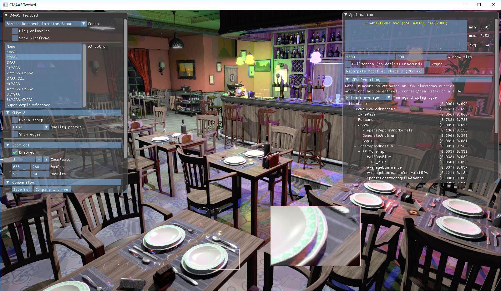

# Adaptive SMAA

Adaptive SMAA is an experimental optimization of SMAA (Subpixel Morphological Antialiasing) that adjusts the search range according to local edge contrast. It is integrated into Intel's CMAA2 sample so the original and adaptive implementations can be tested in the same DirectX 11 demo environment.

> **한국어 요약:** 이 저장소는 논문 **「국소 대비 기반 적응형 탐색을 이용한 SMAA 최적화」**의 구현 코드입니다. 낮은 대비 영역에서는 SMAA의 수평·수직·대각선 탐색 범위를 줄이고, 높은 대비 영역에서는 기존 탐색 범위를 유지합니다. `main`은 개선판이며 `baseline/original-smaa`는 같은 데모 환경에서 SMAA 알고리즘을 개선하기 전 비교 기준입니다.



## Repository layout

| Reference | Purpose |
| --- | --- |
| `main` | Adaptive SMAA implementation |
| `baseline/original-smaa` | Runnable comparison baseline with the original SMAA algorithm |
| `baseline-original-smaa` | Fixed tag pointing to the baseline commit |

The baseline is not intended to be a pristine mirror of the upstream CMAA2 repository. It keeps the same runnable, user-adjusted demo harness used for this project and provides the pre-optimization SMAA implementation. This makes the branch comparison focus on the SMAA change itself.

To inspect the implementation diff:

```powershell
git diff baseline-original-smaa..main -- Projects/CMAA2/SMAA
```

The adaptive implementation changes these six files:

- `Projects/CMAA2/SMAA/SMAA.cpp`
- `Projects/CMAA2/SMAA/SMAA.fx`
- `Projects/CMAA2/SMAA/SMAA.h`
- `Projects/CMAA2/SMAA/SMAA.hlsl`
- `Projects/CMAA2/SMAA/SMAAWrapper.hlsl`
- `Projects/CMAA2/SMAA/vaSMAAWrapperDX11.cpp`

## Method

Local contrast is classified into three tiers. Each tier controls the maximum horizontal/vertical and diagonal search range.

| Contrast tier | Local contrast | Horizontal / vertical search | Diagonal search |
| --- | ---: | ---: | ---: |
| Tier 0 | `< 0.1` | 4 steps | 3 steps |
| Tier 1 | `0.1 - 0.333` | 8 steps | `MAX_DIAG_STEPS / 2` |
| Tier 2 | `>= 0.333` | Existing maximum | Existing maximum |

The original corner-pattern handling is retained. Edge information is stored in an `RG8` target and the contrast tier metadata in an `R8` target through multiple render targets, then read during blending-weight calculation. Compared with using a single `RGBA8` metadata structure, this layout reduces the relevant intermediate storage from 8 to 7 bytes per pixel (12.5%).

## Reported results

The paper's GPU-time measurements used a GeForce GTX 1660 SUPER at 1920 x 1080. Each result is the mean of five 4,800-frame runs.

| Scene | Original SMAA | Adaptive SMAA | Reduction |
| --- | ---: | ---: | ---: |
| Bistro | 0.7133 ms | 0.5790 ms | 18.8% |
| Minecraft Lost Empire | 0.7390 ms | 0.6888 ms | 6.8% |

Reported direct-comparison image quality across eight sample frames:

| Scene | PSNR | FLIP |
| --- | ---: | ---: |
| Bistro | 55.4360 dB | 0.001025 |
| Minecraft Lost Empire | 58.3471 dB | 0.000848 |

These figures describe the recorded experiment; runtime results vary with GPU, driver, scene, resolution, and preset.

## Build

Requirements:

- Windows 10 or 11
- Visual Studio 2022 with Desktop development with C++
- MSVC v143 toolset and a Windows 10 SDK
- DirectX 11-capable GPU

Open `CMAA2.sln`, choose `Release | x64`, and build the solution. From a Developer PowerShell prompt, the equivalent command is:

```powershell
msbuild CMAA2.sln /m /p:Configuration=Release /p:Platform=x64
```

The executable is produced at `Projects/CMAA2/CMAA2.exe`. Build products, Visual Studio state, caches, captures, and generated benchmark output are intentionally excluded from Git; the source media and demo scenes are included.

## Run and compare

1. Run `Projects/CMAA2/CMAA2.exe`.
2. Select a bundled scene such as Bistro or Minecraft Lost Empire.
3. Select SMAA in the antialiasing options.
4. For the paper's stated test condition, select the **Ultra** SMAA quality preset.
5. Use the sample's SMAA-only GPU-time benchmark command for performance measurements.

The demo does not automatically force or record the SMAA preset in its benchmark CSV, so verify **Ultra** manually before collecting comparable measurements.

## Included demo content

The repository retains the complete project-relevant CMAA2 sample content, including the Bistro asset packs, Minecraft Lost Empire, Sponza variants, test screenshots, environment maps, shaders, and embedding tools. Only reproducible build/runtime output is ignored.

## Credits and license

This work builds on:

- **SMAA** by Jorge Jimenez, Jose I. Echevarria, Tiago Sousa, and Diego Gutierrez
- **CMAA2 sample framework** and supporting code by Intel and its contributors

Copyright notices and third-party licenses are preserved in `license.txt`, `Projects/CMAA2/SMAA/LICENSE.txt`, and the corresponding dependency directories. Review those files before redistributing binaries or assets.
